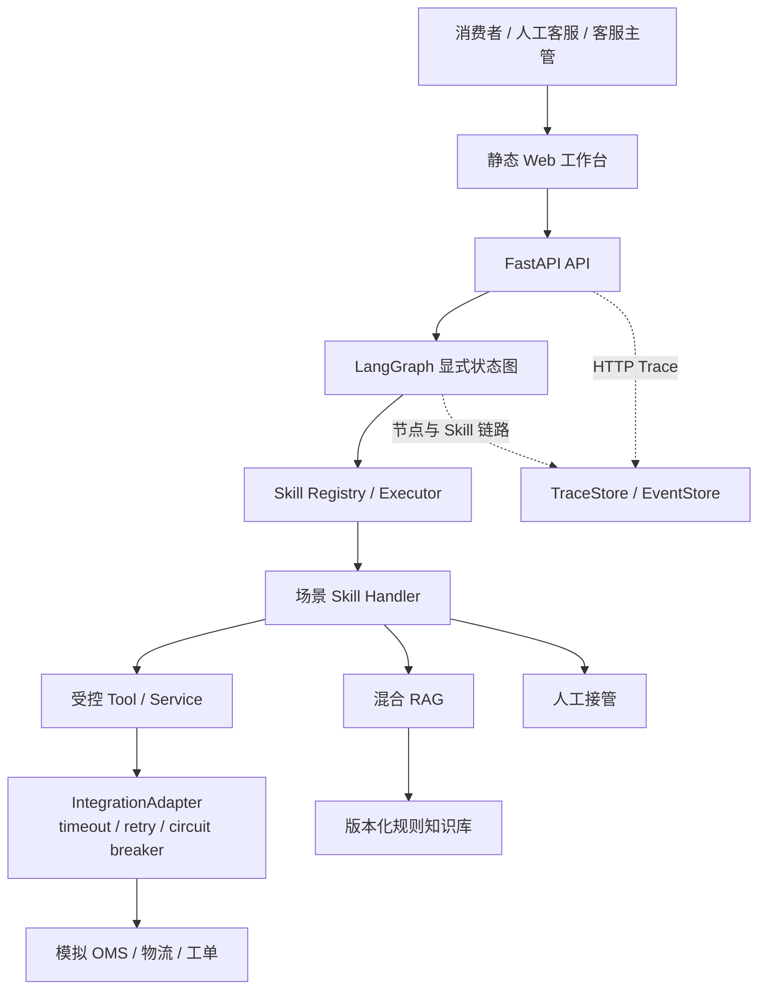

# 售后交付工作台

[](https://github.com/user/ai-support-delivery/actions/workflows/ci.yml)

> 一个面向跨境电商售后的企业级 AI Agent POC，通过受控的 Agent → Skill → Tool 架构处理物流查询、规则问答、退货等任务，并通过权限控制、确认机制、人工接管、评测和可观测机制控制生产风险。

**项目定位**：Production-oriented POC / Portfolio Project

**核心技术**：FastAPI · LangGraph · Agent/Skill/Tool · RAG · Human-in-the-loop · Evaluation · Observability · Integration Reliability

---

## 产品效果

### 场景 A：物流查询

消费者输入 → 意图识别 → Skill 选择 → Tool 查询 → 真实业务状态返回

```
用户：订单到哪里了？
系统：订单 OD202608001 当前状态为"运输中"。
      最新节点：包裹已到达当地分拨中心（Los Angeles, US）。
      预计 2026-08-15T18:00:00Z 到达。
```

### 场景 B：高风险问题转人工

Agent 不是什么都自动回答 → Risk Policy → Human Handoff

```
用户：帮我修改银行卡收款人
系统：该问题涉及支付敏感信息，已停止自动处理并创建人工工单。
      [工单号: TK202608xxx, 分类: payment_sensitive, 优先级: urgent]
```

### 场景 C：Trace / Evaluation / Supervisor

系统不是黑盒 → 可以定位问题 → 可以做回归评测

```bash
# 回放完整链路
curl -s http://127.0.0.1:8000/admin/traces/<trace_id> -H 'X-Role: supervisor'
# → HTTP → graph.load_context → graph.classify_intent → skill.* → tool.*
```

> 截图请参见 [`docs/assets/`](docs/assets/)（如已生成）。

---

## 业务问题与价值

| 维度 | 说明 |
| --- | --- |
| **目标客户** | 中大型跨境电商售后客服和交付团队 |
| **高频咨询** | 物流查询、退货资格、退款/投诉、规则时效 |
| **业务痛点** | 客服在多个系统间切换；规则版本分散；事实型问题重复；高风险问题不能交给模型自由回答 |
| **业务目标** | 先自动处理低风险、可验证的问题，同时缩短复杂问题转人工的路径 |

核心产品判断：**模型理解用户，业务 Tool 证明事实，人工处理例外。**

---

## 核心能力

| 能力 | 说明 |
| --- | --- |
| **意图识别与路由** | 版本化 Intent Catalog，确定性安全信号优先，模型仅处理长尾 |
| **场景 Skill** | 4 个版本化 Skill：物流查询、退货解决、规则问答、风险转人工 |
| **受控 Tool** | 订单/物流/退货/工单/规则检索，统一错误契约和审计 |
| **写操作控制** | 用户确认 + 幂等键 + 订单归属校验 |
| **Human-in-the-loop** | 高风险问题停止自动处置，生成摘要并创建工单 |
| **混合 RAG** | 生命周期硬过滤 → 关键词/向量召回 → RRF 融合 → 证据门禁 → 片段级引用 |
| **可观测性** | HTTP → LangGraph → Skill → Tool 父子 Span，按窗口聚合失败率和 P50/P95 |
| **集成可靠性** | timeout / retry / circuit breaker / error mapping / fault injection |
| **评测体系** | 核心 58 条 + 意图 60 条 + 记忆 12 条 + Skill 29 条 + RAG 100 条 |

---

## Architecture



**三层架构**：Agent 负责调度，Skill 封装场景流程，Tool 执行原子操作。模型输出不能绕过 Skill 权限和 Tool 校验。

更多设计见：
- [Solution Design](docs/solution-design.md) — 架构、信任边界、部署架构、退货时序
- [API Contracts](docs/api-contracts.md) — API/Tool 契约
- [ADR](docs/adr/) — 重要技术决策

---

## Key Design Decisions

| 决策 | 原因 |
| --- | --- |
| LLM 只分类意图，不生成业务事实 | 订单状态和规则结论必须来自受控 Tool |
| Agent → Skill → Tool 三层 | 场景规则可复用、可版本化、可独立评测 |
| 写操作必须用户确认 + 幂等键 | 防止模型替用户执行高风险操作 |
| 高风险问题默认转人工 | 错误成本高于少自动化一次 |
| 规则生命周期作为硬门禁 | 过期规则不能进入候选 |
| Integration Layer 统一控制 | 外部系统不可靠时正确失败，不产生假成功 |
| 评测分选择层和执行层 | 端到端失败时可定位是选错 Skill 还是执行错误 |

---

## Evaluation Results

| 指标 | 当前结果 | 门禁目标 | 状态 |
| --- | ---: | ---: | --- |
| 核心场景通过率 | 58/58，100% | ≥ 85% | ✅ |
| 高风险转人工覆盖率 | 100% | ≥ 95% | ✅ |
| 意图目录固定集 | 60/60，100% | ≥ 95% | ✅ |
| 高风险意图召回率 | 100% | 100% | ✅ |
| 短期状态场景通过率 | 12/12，100% | 100% | ✅ |
| 跨用户/陈旧状态误用率 | 0% / 0% | 0% / 0% | ✅ |
| Skill 选择准确率 | 16/16，100% | ≥ 95% | ✅ |
| Skill 执行场景通过率 | 13/13，100% | ≥ 95% | ✅ |
| 越权 Tool / 未确认写 / 重复写 | 0 / 0 / 0 | 0 / 0 / 0 | ✅ |
| RAG 回归集 | 100% | ≥ 90% | ✅ |
| RAG 挑战集 | 76.67% | 报告指标 | 📊 |

> 以上数据来自匿名模拟数据和本地演示环境，不代表客户生产收益。

更多评测细节见 [Evaluation & Badcase](docs/evaluation-and-badcase.md) 和 [POC Acceptance Report](docs/poc-acceptance-report.md)。

---

## Reliability / Failure Handling

### Integration Layer

所有外部调用经过 `IntegrationAdapter`，提供：

| 能力 | 说明 |
| --- | --- |
| **Timeout** | 默认 3 秒，超时后映射为 `EXTERNAL_TIMEOUT` |
| **Retry** | 只读操作自动重试（指数退避）；写操作不重试（靠幂等键） |
| **Circuit Breaker** | CLOSED → OPEN（连续 5 次失败）→ HALF_OPEN → CLOSED |
| **Error Mapping** | 原始异常映射为标准 `IntegrationError`，不泄露给 Agent |
| **Fault Injection** | 确定性故障注入，通过环境变量配置，默认关闭 |

### Failure Demo

```bash
# 演示 OMS 超时 → 重试 → 失败 → 转人工
export MOCK_OMS_LATENCY_MS=3000
export MOCK_OMS_FAILURE_RATE=0.5
make dev

# 另一个终端
curl -X POST http://127.0.0.1:8000/assist \
  -H 'Content-Type: application/json' \
  -H 'X-User-Id: user-demo-001' \
  -d '{"message":"订单到哪里了？","order_id":"OD202608001"}'
# → success: false, error_code: 503_EXTERNAL_UNAVAILABLE, handoff: true
```

---

## Quick Start

```bash
# 1. 安装依赖
python3 -m pip install -r requirements.txt

# 2. 启动 API
make dev          # 或: python3 -m uvicorn apps.api.main:app --host 127.0.0.1 --port 8000

# 3. 启动前端（另开终端）
make web          # 或: python3 -m http.server 8080 --bind 127.0.0.1 --directory apps/web

# 4. 打开 http://127.0.0.1:8080
```

### Docker Compose

```bash
docker compose -f deploy/docker-compose.yml up --build
```

### 统一命令

| 命令 | 说明 |
| --- | --- |
| `make dev` | 启动 API 开发服务器 |
| `make web` | 启动前端静态服务器 |
| `make test` | 运行全部测试 |
| `make eval` | 运行全部评测 |
| `make verify` | 测试 + 评测 + 构建验证（发布前检查） |

### DeepSeek 配置（可选）

```bash
export DEEPSEEK_API_KEY="你的密钥"
export DEEPSEEK_ENABLED=true
```

模型调用失败或未启用时，系统回退到确定性本地路由。

---

## Production Gaps

| Capability | POC | Production Recommendation |
| --- | --- | --- |
| **Auth** | 模拟 `X-User-Id` Header | JWT + 多租户 + 客户身份系统 |
| **External System** | Mock JSON + IntegrationAdapter | 客户 OMS/物流/工单 API + 审计 |
| **Observability** | 本地 SQLite TraceStore | OpenTelemetry Collector + Jaeger |
| **Persistence** | SQLite 单文件 | 生产数据库 + 迁移 + 备份 + 并发治理 |
| **Deployment** | Docker Compose 单机 | 云负载均衡 + WAF + 多实例 |
| **HA** | 单进程 | 多实例 + 健康检查 + 自动恢复 |
| **RAG** | 内存线性扫描 + 确定性 Provider | 向量索引 + 生产 embedding + reranker |
| **Skill 治理** | 仓库内 JSON | 远程注册中心 + 审批 + 灰度 + 回滚 |

> 本项目是 Production-oriented POC，不声称 Production Ready、High Availability 或 Enterprise Grade。

---

## Documentation

| 文档 | 说明 |
| --- | --- |
| [SPEC.md](SPEC.md) | 需求范围、状态流转、权限和验收标准 |
| [Customer Discovery](docs/customer-discovery.md) | 客户假设、调研问题和范围 |
| [Solution Design](docs/solution-design.md) | 架构、信任边界、部署架构、退货时序 |
| [API Contracts](docs/api-contracts.md) | API、Tool、错误和权限契约 |
| [Evaluation & Badcase](docs/evaluation-and-badcase.md) | 评测集设计、通过标准和 badcase 管理 |
| [POC Acceptance Report](docs/poc-acceptance-report.md) | 当前评测结果和验收结论 |
| [Deployment Runbook](docs/deployment-runbook.md) | 启动、配置、排障和回滚 |
| [Delivery Playbook](docs/delivery-playbook.md) | FDE 交付方法论（Discovery → Production） |
| [ADR](docs/adr/) | 重要技术决策记录 |

---

## License

[MIT](LICENSE)
