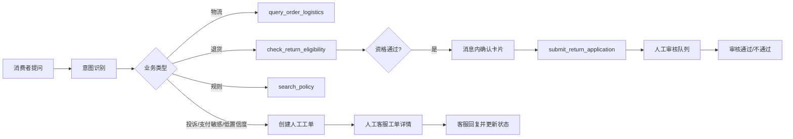

# 售后交付工作台

跨境电商售后 AI 客服交付 POC，面向 AI 产品、解决方案和交付岗位作品集展示。

它演示一个真实售后场景中的完整闭环：消费者提问 → 识别意图 → 受控 Tool 核验 → 规则/业务判断 → 用户确认写操作 → 人工接管 → 质量评测与 badcase 修复。

这是可复现、可评测的演示系统，不是生产退款系统。订单、物流、规则和工单均为匿名模拟数据，当前结果不能直接代表客户生产收益。

## 先看什么

如果只看 3 分钟，建议按以下路径演示：

1. 消费者询问物流，系统返回订单状态、最新节点、地点和预计到达时间。
2. 消费者询问退货，系统根据订单和生效规则判断资格，并在消息中展示确认提交卡片。
3. 消费者点击确认后，系统创建“待审核”退货申请；该状态不等于退款完成。
4. 消费者提出退款投诉或支付敏感问题，系统停止自动处置，创建人工工单并生成摘要。
5. 客服在人工接管页面查看会话上下文、已执行动作，回复消费者并更新处理状态。
6. 主管/实施人员查看基础质量指标、风险事件和规则版本，并回看失败样例。

前端是无构建步骤的静态工作台，启动方式见[快速开始](#快速开始)。当前仓库未包含在线 Demo 或截图；本地启动后即可按上述脚本复现。

## 我在解决什么问题

### 客户假设

本 POC 面向需要处理大量售后咨询的跨境电商团队。以下是立项前应与客户确认的业务假设，不是虚构的客户事实：

| 维度 | 首期假设与待确认问题 |
| --- | --- |
| 目标客户 | 中大型跨境电商的售后客服和交付团队 |
| 高频咨询 | 物流查询、退货资格、退款/投诉、规则时效 |
| 业务系统 | OMS、物流查询、售后工单、规则/知识库 |
| 主要痛点 | 客服在多个系统间切换；规则版本分散；事实型问题重复；高风险问题不能交给模型自由回答 |
| 业务目标 | 先自动处理低风险、可验证的问题，同时缩短复杂问题转人工的路径 |
| 需要客户提供的基线 | 会话量、问题类型分布、人工处理时长、人工成本、投诉/退款争议成本和现有转人工率 |

### 为什么优先做这四类场景

物流和退货资格通常是高频、规则相对明确、适合受控查询的场景；投诉/退款争议则用于验证风险边界和人工接管能力。四类场景组合起来，既能展示自动化收益，也能展示“不该自动化时如何停下来”。

## AI 产品判断与取舍

本项目的核心判断不是“让模型回答所有问题”，而是把模型能力限制在适合它的环节，把业务事实和高风险动作交给可审计的系统：

| 产品决策 | 原因 |
| --- | --- |
| 模型主要负责意图理解 | 自然语言表达复杂，但订单状态和规则结论必须来自业务数据 |
| 订单、物流和申请状态只允许来自受控 Tool | 防止模型编造事实，便于审计、回放和定位错误 |
| 规则回答必须带生效版本和来源 | 规则会变化；客服和客户必须知道答案依据 |
| 退货申请采用“判断 → 用户确认 → 提交”两阶段 | 资格判断是只读操作，提交申请是写操作，不能让模型替用户执行 |
| 投诉、支付敏感、退款争议默认转人工 | 这类问题的错误成本高于少自动化一次 |
| 模型失败时回退到确定性路由 | AI 不可用时，低风险基础路径仍可演示；失败不能导致无依据回答 |
| 没有可靠依据时拒答或转人工 | 在售后场景中，可信度优先于覆盖率 |

因此，这不是让 Agent 自主修改订单或直接退款的系统，而是“模型理解用户，业务 Tool 证明事实，人工处理例外”的交付方案。

## 当前能力边界

### 消费者体验

- 物流查询：返回订单状态、承运商、最新物流节点、地点和预计到达时间。
- 退货资格：根据订单状态、签收时间、品类规则和退货原因返回资格、依据、规则版本和下一步。
- 规则问答：从本地版本化规则文档中检索有效内容，回答附标题和版本；当前是受控关键词匹配，不是生产级向量 RAG。
- 投诉/退款争议：停止自动处置，创建人工工单并生成会话摘要。
- 常见问题快捷填充：仅填入输入框，仍由消费者确认、修改并发送。
- 已绑定订单作为默认上下文，减少重复输入订单号。
- 退货资格通过后，必须点击会话消息中的“确认提交退货申请”才执行写操作。

### 人工客服与主管体验

- 人工客服可查看人工接管队列、投诉工单和待审核退货申请。
- 工单详情展示会话摘要、订单上下文、Tool 结果、已执行动作、回复框和处理状态。
- 支持将工单更新为“已解决”“待补充信息”或“已升级主管”。
- 退货审核支持“审核通过”和“审核不通过”；驳回必须填写原因。
- 提供基础质量指标和风险事件视图，用于 POC 演示；尚未实现生产级实时监控、客服自动分配和完整质量运营看板。

### 安全与可靠性

- DeepSeek 仅作为可选的意图分类器，不生成订单事实、退货结论或规则引用。
- 模型未配置、超时或失败时回退到确定性的本地路由。
- 订单事实来自受控 Tool，并校验 `X-User-Id` 与订单归属。
- 写操作需要明确确认和幂等键；“待审核”不代表退款完成。
- Tool 统一返回 `success`、`data`、`error_code`、`message`、`trace_id`。
- 低置信度、无依据、订单异常和高风险争议进入人工处理，不以模型猜测替代事实。

## 当前评测结果

以下数据来自当前版本实际执行的 `evals/run_eval.py` 和 `evals/latest-report.json`，不是生产承诺。

| 指标 | 当前结果 | POC/验收目标 | 状态 |
| --- | ---: | ---: | --- |
| 核心场景通过率 | 55/55，100% | ≥ 85% | 达标 |
| 规则引用有效率 | 100% | ≥ 90% | 达标 |
| 高风险转人工覆盖率 | 100% | ≥ 95% | 达标 |
| Tool 成功率 | 100% | ≥ 95% | 达标 |
| 本地 TestClient P95 | 约 749ms | ≤ 10 秒 | 达标 |

当前固定评测已覆盖支付敏感独立路由、中文多轮追问、中文口语/省略表达和知识无依据场景，55/55 通过。该结果仅代表匿名模拟数据和本地演示环境，不代表客户生产收益。

### 指标如何服务于客户价值

当前 POC 主要验证产品质量，不足以证明真实业务收益。上线试点前，应使用客户最近 4 周数据建立基线，并分三层观察：

| 层级 | 指标示例 | 当前能否证明 |
| --- | --- | --- |
| 产品质量 | 事实准确率、引用有效率、风险转人工覆盖率、Tool 错误率、重复建单率 | 可以用固定评测集初步验证 |
| 用户体验 | 首次有效回复时延、一次解决率、转人工等待时间、补充信息次数 | 只能在演示环境部分观察 |
| 业务价值 | 自动解决率、平均处理时长、单会话人工成本、投诉/退款风险损失 | 需要客户生产基线和灰度数据 |

建议的收益测算口径：

```text
月度节省人工成本
= 月均售后会话数 × 自动解决率提升幅度 × 单次人工处理成本

月度释放人工工时
= 减少的人工介入会话数 × 单次平均处理时长

风险损失避免额
= 高风险问题量 × 漏接率下降幅度 × 单次客诉/退款争议成本
```

这些公式用于试点设计，不把小规模 POC 评测结果直接外推为客户 ROI。

## 下一步修复优先级

- **已完成 P0**：支付敏感意图已独立路由为 `payment_sensitive`，并有工单分类断言和固定回归样本。
- **已完成 P0**：`run_eval.py` 生成 `latest-report.json`，随后自动生成验收报告，避免手工复制指标。
- **已完成 P1（中文范围）**：固定集已加入口语化表达、错别字/省略表达、连续追问和知识版本断言；英文暂不纳入本轮产品范围。
- **已完成 P1**：补充中文错别字、规则冲突和跨会话异常；多轮会话已使用 SQLite 持久化。
- **P1**：接入真实认证、持久化工单和客户级数据隔离。
- **P1**：补充浏览器级 E2E、告警和写操作禁用开关验证。
- **已完成 P2（检索架构）**：规则检索已升级为向量召回 + 关键词召回 + RRF 融合 + Cross-Encoder/model Provider 重排，并增加 Recall@K、Top-1 重排和知识更新评测；当前本地使用确定性测试 Provider，生产需注入真实模型服务。
- **P2**：建设生产级客服分配、实时质量看板、灰度发布和回滚流程。

## 评测集与 Badcase：如何建立质量闭环

评测集和 badcase 是这个项目最重要的交付资产之一。它们不是为了证明“模型答得像不像”，而是为了验证一条完整的业务契约：意图是否正确、是否调用正确 Tool、事实是否来自受控数据、规则是否有有效引用、风险问题是否转人工、写操作是否经过确认，以及失败时是否可解释、可恢复。

当前评测集按正常主流程、业务边界、Tool 异常、风险与转人工、知识无依据五类组织，共 55 条；每条用例记录输入、前置数据、预期意图、允许 Tool、预期事实、引用要求、转人工要求、HTTP 状态和用户可见文案。当前范围优先覆盖中文口语、错别字/省略表达和多轮追问，英文样本暂不纳入。

多轮会话当前支持：通过 `session_id` 继承已绑定订单和上一轮意图；首轮缺少退货原因时，下一轮可补充原因；物流查询后可追问预计到达时间；同一会话连续两次未解决时自动转人工。当前上下文使用进程内存储，重启会丢失，生产环境需替换为带租户隔离、过期策略和脱敏的持久化会话存储。

Badcase 则采用“发现 → 脱敏 → 定义预期 → 根因归类 → 修复 → 加入回归 → 记录版本”的流程。目前 `evals/badcases.jsonl` 已记录中文检索、错误路由、Tool 失败降级、业务文案和自然语言参数解析等问题。高风险漏接、重复写入、无依据回答和越权读取应作为发布阻断项，不能被整体平均通过率掩盖。

评测集字段设计、覆盖矩阵、数据集划分、通过标准和 badcase 生命周期见 [`docs/evaluation-and-badcase.md`](docs/evaluation-and-badcase.md)。

## 角色与页面

| 角色 | 可访问页面 | 主要任务 |
| --- | --- | --- |
| 消费者 | 演示导览、消费者对话 | 咨询售后问题、确认退货申请 |
| 人工客服 | 消费者对话（只读）、人工接管 | 查看上下文、审核申请、处理工单 |
| 客服主管 | 人工接管、基础指标、知识与规则 | 查看队列、质量和风险、审核/升级 |
| 实施管理员（内部角色） | 演示导览、基础指标、知识与规则 | 配置/验证规则、评测和交付质量；不作为普通用户角色展示 |

页面导航和右侧快捷操作均按角色白名单裁剪。角色切换后只能进入当前角色允许的页面。

## 业务流程



## 快速开始

### 1. 安装依赖

```bash
python3 -m pip install -r requirements.txt
```

### 2. 启动 API

```bash
python3 -m uvicorn apps.api.main:app --host 127.0.0.1 --port 8000
```

健康检查：<http://127.0.0.1:8000/health>

### 3. 启动前端

另开一个终端，在项目根目录执行：

```bash
python3 -m http.server 8080 --bind 127.0.0.1 --directory apps/web
```

打开 <http://127.0.0.1:8080>。

### 4. Docker Compose

```bash
docker compose -f deploy/docker-compose.yml up --build
```

当前环境尚未完成 Docker 容器网络的独立采样；具备 Docker CLI 后，应补充 Compose 启动、健康检查和容器网络 P95 验证。

## DeepSeek 配置

DeepSeek 是可选的意图分类依赖。模型调用失败或未启用时，系统回退到本地意图路由。

```bash
export DEEPSEEK_API_KEY="你的密钥"
export DEEPSEEK_ENABLED=true
python3 -m uvicorn apps.api.main:app --host 127.0.0.1 --port 8000
```

如需关闭模型调用：

```bash
export DEEPSEEK_ENABLED=false
```

不要提交 `.env`、API Key 或包含密钥的日志。

## API 示例

### 物流查询

```bash
curl -X POST http://127.0.0.1:8000/tools/query-order-logistics \
  -H 'Content-Type: application/json' \
  -H 'X-User-Id: user-demo-001' \
  -d '{"order_id":"OD202608001"}'
```

### 统一对话入口

```bash
curl -X POST http://127.0.0.1:8000/assist \
  -H 'Content-Type: application/json' \
  -H 'X-User-Id: user-demo-001' \
  -d '{"message":"订单到哪里了？","order_id":"OD202608001","session_id":"demo-session-001"}'
```

完整输入、输出、权限和错误契约见 [`docs/api-contracts.md`](docs/api-contracts.md)。

## 测试与验收

```bash
python3 -m pytest -q
python3 evals/validate_dataset.py
python3 evals/run_policy_eval.py
python3 evals/run_eval.py
```

固定评测集覆盖正常路径、业务边界、Tool 异常、风险转人工、规则无依据、支付敏感独立分类、中文多轮追问、退货写操作和业务文案契约。交付前还应补做 Docker Compose 和容器网络验证。

## 项目结构

```text
apps/api/                 # FastAPI、编排入口、受控 Tool 和服务
apps/api/support/conversations.py # POC 多轮会话上下文存储
apps/web/index.html       # 无构建静态工作台
data/mock/                # 匿名订单、物流和演示数据
knowledge/                # 版本化规则和知识数据
evals/                    # 固定评测集、校验和评测脚本
evals/badcases.jsonl      # badcase、根因、修复和回归记录
evals/run_policy_eval.py  # RAG 召回、重排、拒答和知识更新评测
evals/policy-report.json  # 最近一次 RAG 专项评测结果
tests/                    # API、业务状态、权限和前端回归测试
docs/api-contracts.md     # API 与 Tool 契约
docs/solution-design.md   # 解决方案设计和数据流
docs/deployment-runbook.md# 启动、配置、排障和回滚
SPEC.md                   # 需求、边界和验收标准
```

## 已知限制与生产化方向

当前 POC 不包含真实认证、真实订单/物流连接、真实退款、持久化工单、实时质量运营和多租户隔离。工单和事件使用内存存储，进程重启后会清空；会话上下文已使用 SQLite 持久化；规则检索链路已具备生产级 Provider 接口，但默认仍使用本地确定性 embedding/reranker，生产必须配置真实模型服务和索引治理。

生产化前至少需要：

1. 接入客户认证、授权和租户级数据隔离。
2. 使用持久化数据库和可靠事件流，保证状态与消息可恢复。
3. 对 OMS、物流、退款和知识库接入设置超时、重试、熔断、审计和告警。
4. 增加客服分配、实时指标、灰度发布、回滚和写操作紧急禁用能力。
5. 为混合 RAG 接入生产 embedding、向量索引和 Cross-Encoder/model reranker，建立索引版本、知识版本发布和回滚流程。
6. 将静态 POC 前端升级为可维护的前端工程，并补充浏览器级 E2E 测试。

## 相关文档

- [`SPEC.md`](SPEC.md)：需求范围、状态流转、权限和验收标准。
- [`docs/customer-discovery.md`](docs/customer-discovery.md)：客户假设、调研问题和范围。
- [`docs/solution-design.md`](docs/solution-design.md)：整体解决方案设计和产品取舍。
- [`docs/api-contracts.md`](docs/api-contracts.md)：API、Tool、错误和权限契约。
- [`docs/deployment-runbook.md`](docs/deployment-runbook.md)：启动、配置、排障和回滚。
- [`docs/poc-acceptance-report.md`](docs/poc-acceptance-report.md)：当前固定评测和验收结论。
- [`docs/evaluation-and-badcase.md`](docs/evaluation-and-badcase.md)：评测集设计、通过标准和 badcase 管理方法。
