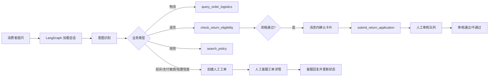

# 售后交付工作台

跨境电商售后 AI 客服交付 POC，面向 AI 产品、解决方案和交付岗位作品集展示。

它演示一个真实售后场景中的完整闭环：消费者提问 → 识别意图 → 受控 Tool 核验 → 规则/业务判断 → 用户确认写操作 → 人工接管 → 质量评测与 badcase 修复。

这是可复现、可评测的演示系统，不是生产退款系统。订单、物流、规则和工单均为匿名模拟数据，当前结果不能直接代表客户生产收益。

## 解决什么问题

### 客户假设

本 POC 面向需要处理大量售后咨询的跨境电商团队：

| 维度 | 待确认问题 |
| --- | --- |
| 目标客户 | 中大型跨境电商的售后客服和交付团队 |
| 高频咨询 | 物流查询、退货资格、退款/投诉、规则时效 |
| 业务系统 | OMS、物流查询、售后工单、规则/知识库 |
| 主要痛点 | 客服在多个系统间切换；规则版本分散；事实型问题重复；高风险问题不能交给模型自由回答 |
| 业务目标 | 先自动处理低风险、可验证的问题，同时缩短复杂问题转人工的路径 |
| 需要客户提供的基线 | 会话量、问题类型分布、人工处理时长、人工成本、投诉/退款争议成本和现有转人工率 |

### 为什么优先做这四类场景

物流和退货资格通常是高频、规则相对明确、适合受控查询的场景；投诉/退款争议则用于验证风险边界和人工接管能力。四类场景组合起来，既能展示自动化收益，也能展示“不该自动化时如何停下来”。

## AI 产品判断与取舍

本项目的核心判断不是“让模型回答所有问题”，而是把模型能力限制在适合它的环节，把业务事实和高风险动作交给可审计的系统：

| 产品决策 | 原因 |
| --- | --- |
| 模型主要负责意图理解 | 自然语言表达复杂，但订单状态和规则结论必须来自业务数据 |
| 订单、物流和申请状态只允许来自受控 Tool | 防止模型编造事实，便于审计、回放和定位错误 |
| 规则回答必须带生效版本和来源 | 规则会变化；客服和客户必须知道答案依据 |
| 退货申请采用“判断 → 用户确认 → 提交”两阶段 | 资格判断是只读操作，提交申请是写操作，不能让模型替用户执行 |
| 投诉、支付敏感、退款争议默认转人工 | 这类问题的错误成本高于少自动化一次 |
| 用版本化 Intent Catalog 管意图，而不是只写 Prompt | 让业务边界、责任人、风险优先级、正反例和 Tool 权限成为可评测、可审计、可回滚的产品资产 |
| 多意图保留“主意图 + 次意图” | 高风险诉求可以抢占自动执行，同时不丢失用户同轮提出的物流、退货等后续诉求 |
| 短期记忆只保存结构化业务状态 | 保留连续追问体验，同时避免聊天摘要、过期事实或旧订单信息污染业务判断 |
| 模型失败时回退到确定性路由 | AI 不可用时，低风险基础路径仍可演示；失败不能导致无依据回答 |
| 没有可靠依据时拒答或转人工 | 在售后场景中，可信度优先于覆盖率 |
| 规则生命周期作为硬门禁 | 过期规则不能依赖排序降权；它必须在候选生成前被排除 |
| 检索相关与证据充分分开 | 主题相似不代表文档能回答问题；证据分数不足时拒答 |
| 开发集、回归集、挑战集分开 | 避免用调过参数的题目证明泛化能力，同时保留稳定发布契约 |
| 对四种检索链路做消融 | 用效果、拒答安全性、延迟和成本证明组件价值，避免技术堆砌 |

因此，这不是让 Agent 自主修改订单或直接退款的系统，而是“模型理解用户，业务 Tool 证明事实，人工处理例外”的交付方案。

`/assist` 已使用 LangGraph 显式状态图编排：先加载用户隔离的会话上下文，再分类意图并经过低置信度/高风险门禁，最后只进入物流、退货、规则检索或人工接管节点。LangGraph 负责状态和控制流，不替代业务 Service，也不获得绕过权限、用户确认或幂等校验的能力。

## 当前能力边界

### 消费者体验

- 物流查询：返回订单状态、承运商、最新物流节点、地点和预计到达时间。
- 退货资格：根据订单状态、签收时间、品类规则和退货原因返回资格、依据、规则版本和下一步。
- 规则问答：先按 `status/effective_from/effective_to/region` 硬过滤，再执行关键词与向量召回、RRF 融合和证据充分性门禁；回答附实际支持片段、标题和版本。本地消融未证明测试 reranker 有边际收益，默认使用 `fusion`；生产接入真实模型后必须重新评测才能启用 `fusion_rerank`。
- 投诉/退款争议：停止自动处置，创建人工工单并生成会话摘要。
- 常见问题快捷填充：仅填入输入框，仍由消费者确认、修改并发送。
- 已绑定订单作为默认上下文，减少重复输入订单号；每个槽位带来源、置信度、作用域和独立 TTL，用户纠正订单后旧订单状态立即失效。
- 退货资格通过后，必须点击会话消息中的“确认提交退货申请”才执行写操作。

### 人工客服与主管体验

- 人工客服可查看人工接管队列、投诉工单和待审核退货申请。
- 人工接管队列支持服务端分页，以及按工单/退货申请类型、处理状态、工单号/申请单号/订单号/用户诉求搜索。
- 工单详情展示会话摘要、订单上下文、Tool 结果、已执行动作、回复框和处理状态。
- 支持将工单更新为“已解决”“待补充信息”或“已升级主管”。
- 退货审核支持“审核通过”和“审核不通过”；驳回必须填写原因。
- 提供基础质量指标和风险事件视图，用于 POC 演示；尚未实现生产级实时监控、客服自动分配和完整质量运营看板。

### 安全与可靠性

- DeepSeek 仅作为可选的意图分类器，不生成订单事实、退货结论或规则引用。
- `config/intent-catalog.json` 统一定义六类意图的边界、风险、责任人、正反例和 Tool 权限；模型只处理目录未匹配的长尾表达，输出仍受目录约束。
- 支付敏感/投诉信号优先于普通意图；分类结果保留次意图并写入人工摘要，最终执行前再次校验“意图—Tool”权限。
- 模型未配置、超时或失败时回退到确定性的本地路由。
- 订单事实来自受控 Tool，并校验 `X-User-Id` 与订单归属。
- 写操作需要明确确认和幂等键；“待审核”不代表退款完成。
- Tool 统一返回 `success`、`data`、`error_code`、`message`、`trace_id`。
- 每个 HTTP 请求返回 `X-Trace-Id`；`/assist` 可回放到 LangGraph 节点及其模型、RAG、Tool 子调用，并按时间窗口分析失败率和 P50/P95。
- 低置信度、无依据、订单异常和高风险争议进入人工处理，不以模型猜测替代事实。

## 当前评测结果

以下数据来自当前版本实际执行的 `evals/run_eval.py` 和 `evals/latest-report.json`，不是生产承诺。

| 指标 | 当前结果 | POC/验收目标 | 状态 |
| --- | ---: | ---: | --- |
| 核心场景通过率 | 58/58，100% | ≥ 85% | 达标 |
| 规则引用有效率 | 100% | ≥ 90% | 达标 |
| 高风险转人工覆盖率 | 100% | ≥ 95% | 达标 |
| Tool 成功率 | 100% | ≥ 95% | 达标 |
| 本地 TestClient P95 | 约 80.84ms | ≤ 10 秒 | 达标 |
| 意图目录固定集 | 60/60，100% | ≥ 95% | 达标 |
| 高风险意图召回率 | 100% | 100% | 达标 |
| 短期状态场景通过率 | 12/12，100% | 100% | 达标 |
| 跨用户/陈旧状态误用率 | 0% / 0% | 0% / 0% | 达标 |

两项 P0 专项门禁也已执行：Intent Catalog 固定集 60/60，主意图准确率 100%、高风险召回率 100%、多意图次意图召回率 100%；短期状态场景 12/12，跨用户泄漏率 0%、陈旧槽位误用率 0%、订单纠正准确率 100%。前者验证当前确定性安全路由和目录边界，不代表 DeepSeek 等真实模型在生产流量上的分类效果；后者验证结构化状态契约，不代表生产数据库的容量与并发能力。

当前固定评测已覆盖支付敏感独立路由、中文多轮追问、中文口语/错别字、跨用户越权、重复写入和知识无依据场景，58/58 通过。该结果仅代表匿名模拟数据和本地演示环境，不代表客户生产收益。

RAG 专项评测另有 100 条样本：开发集 30 条、固定回归集 40 条、挑战集 30 条。当前本地 `fusion` 在开发集和回归集为 100%，挑战集为 76.67%；挑战集的失败被保留，用于呈现当前小语料和确定性 Provider 的真实泛化边界，不把它反向调成“又一个开发集”。

### 为什么要做检索消融

同一批数据分别运行 `lexical-only`、`vector-only`、`fusion`、`fusion+rerank`，目的是回答每个组件解决了什么问题、收益是否覆盖成本。正确文档没进 Top5 是召回问题，进了 Top5 但没到 Top1 是排序问题，Top1 正确但证据不足则是可回答性问题；不拆开就只能笼统地说“RAG 效果不好”，也无法判断该换 embedding、调融合、加 reranker，还是加强拒答门禁。

当前结果也说明消融不是为了证明技术越多越好：在仅两条当前有效规则的小语料中，lexical 和 fusion 的回归集都为 100%，确定性 vector-only 为 75.00%，加入测试 lexical reranker 后为 97.50%，反而出现负收益。因此本地默认保留 `fusion`，真实 reranker 的准确率收益、P95 和调用成本达到验收标准后才进入生产默认链路。

### 为什么需要三套数据集

- 开发集允许反复查看和调参数，作用是定位问题，不能用来证明泛化。
- 固定回归集保存核心业务契约与历史 badcase，作用是阻止新版本把已经正确的能力改坏。
- 挑战集在验收阶段检查未针对性调优的口语、噪声、错误前提和同领域无答案问题；一旦根据它调参，它就已经泄漏，必须降级为开发数据并补充新挑战样本。

如果三者混用，同一批题既指导关键词、阈值和 Prompt，又用于宣称 100%，得到的是对测试题的适配程度，不是对真实用户问题的预测能力。

### 为什么意图识别需要目录、混淆矩阵和风险优先级

可以把这三项能力理解成：先统一业务规则，再检查系统容易错在哪里，最后规定多个诉求同时出现时先处理哪个。

| 机制 | 解决的问题 | 本项目中的做法 |
| --- | --- | --- |
| 意图目录 | 系统有哪些意图，每个意图能做什么、不能做什么 | 集中记录物流、退货、投诉等意图的定义、负责人、正反例、风险等级、必需信息和允许调用的 Tool |
| 混淆矩阵 | 系统经常把哪类问题错分成哪类 | 分别统计“投诉错成物流”“物流错成投诉”等错误，而不只看一个总体准确率 |
| 风险优先级 | 一句话包含多个诉求时，哪个诉求决定当前动作 | 支付敏感和投诉优先于物流、退货等普通咨询，先停止自动处理并转人工 |

如果只在 Prompt 里列出几个意图，新增或修改意图时，还要分别修改代码路由、Tool 权限和测试，很容易出现各处定义不一致。例如 Prompt 已经增加“支付敏感”，但 Tool 权限没有更新，系统仍可能继续执行不该执行的业务操作。Intent Catalog 把这些规则统一放在一个带版本号的配置中，出了问题可以追溯“当时使用哪一版规则，为什么这样分类和调用 Tool”。

混淆矩阵的价值是区分错误的方向，因为不同错误的业务后果不同：把物流问题错分成投诉，通常只是多转一次人工；把投诉错分成物流，却可能漏掉高风险问题。因此项目除了要求整体准确率达到 95%，还单独要求固定评测集中的高风险意图召回率达到 100%，防止总体平均分掩盖严重错误。

用户也可能在一句话中提出多个诉求。例如“包裹没到，我要投诉”同时包含物流和投诉。本项目将投诉设为主意图，决定当前先转人工；物流作为次意图写入客服摘要，让人工知道投诉的具体原因。这样既不会为了查物流而忽略投诉，也不会因为只保留“投诉”标签而丢失用户的实际问题。

最后，系统在真正执行 Tool 前还会再检查一次权限。例如物流意图只能查询物流，不能提交退货申请。这样即使分类、Prompt 或代码路由发生错误，也能在业务操作前停止执行，避免一次识别错误直接变成错误操作。

### 为什么短期记忆不是“保存更多聊天”

售后多轮真正需要复用的是订单号、退货原因、上一意图和少量 Tool 已验证事实，而不是整段聊天。系统为每个状态记录来源、置信度、会话/订单作用域与过期时间：订单绑定默认 24 小时，上一意图 30 分钟，退货原因 60 分钟，物流/退货事实 5/15 分钟；用户显式输入高于继承状态，切换订单立即清除旧订单作用域的数据。实时回答仍重新调用受控 Tool，不把缓存事实当作永久真相。

不做这种治理有两种代价：完全无状态会让用户每轮重复订单号，降低完成率；直接保存全文或摘要则无法证明值从哪里来、是否仍有效、属于哪个订单，容易出现旧物流状态复用、退货原因串单和跨用户泄漏。TTL 也不能只设一个值：放长会增加陈旧事实风险，过短则增加追问和 Tool 调用，需要按业务变化速度分别校准。

### 指标如何服务于客户价值

客服主管视角的质量看板第一期将指标解释为可行动的业务信号：服务会话数反映使用量；业务核实成功率反映订单、物流或规则信息是否成功获取；转人工率反映人工资源压力；知识依据覆盖率反映规则回答是否有有效版本和引用。看板同时展示最近质量趋势、问题类型分布、风险原因排行和风险事件，帮助主管判断“是否稳定、哪里出问题、下一步处理什么”。当前演示数据为进程内事件，缺少样本时显示暂无数据，不代表生产收益。

当前 POC 主要验证产品质量，不足以证明真实业务收益。上线试点前，应使用客户最近 4 周数据建立基线，并分三层观察：

| 层级 | 指标示例 | 当前能否证明 |
| --- | --- | --- |
| 产品质量 | 事实准确率、引用有效率、风险转人工覆盖率、Tool 错误率、重复建单率 | 可以用固定评测集初步验证 |
| 用户体验 | 首次有效回复时延、一次解决率、转人工等待时间、补充信息次数 | 只能在演示环境部分观察 |
| 业务价值 | 自动解决率、平均处理时长、单会话人工成本、投诉/退款风险损失 | 需要客户生产基线和灰度数据 |

建议的收益测算口径：

```text
月度节省人工成本
= 月均售后会话数 × 自动解决率提升幅度 × 单次人工处理成本

月度释放人工工时
= 减少的人工介入会话数 × 单次平均处理时长

风险损失避免额
= 高风险问题量 × 漏接率下降幅度 × 单次客诉/退款争议成本
```

这些公式用于试点设计，不把小规模 POC 评测结果直接外推为客户 ROI。


## 评测集与 Badcase：如何建立质量闭环

评测集和 badcase 是这个项目最重要的交付资产之一。它们不是为了证明“模型答得像不像”，而是为了验证一条完整的业务契约：意图是否正确、是否调用正确 Tool、事实是否来自受控数据、规则是否有有效引用、风险问题是否转人工、写操作是否经过确认，以及失败时是否可解释、可恢复。

当前评测集按正常主流程、业务边界、Tool 异常、风险与转人工、知识无依据五类组织，共 58 条；每条用例记录输入、前置数据、预期意图、允许 Tool、预期事实、引用要求、转人工要求、HTTP 状态和用户可见文案。当前范围优先覆盖中文口语、错别字/省略表达、多轮追问、越权和重复写入，英文样本暂不纳入。

多轮会话当前支持：通过 `session_id` 继承仍有效的结构化状态；首轮缺少退货原因时，下一轮可补充原因；物流查询后可追问预计到达时间；显式切换订单会清除旧订单状态；同一会话连续两次未解决时自动转人工。会话上下文已使用 SQLite 持久化并按用户隔离；生产环境仍需补充租户隔离、正式 Schema 迁移、备份、脱敏和并发治理。

Badcase 则采用“发现 → 脱敏 → 定义预期 → 根因归类 → 修复 → 加入回归 → 记录版本”的流程。目前 `evals/badcases.jsonl` 已记录中文检索、错误路由、Tool 失败降级、业务文案和自然语言参数解析等问题。高风险漏接、重复写入、无依据回答和越权读取应作为发布阻断项，不能被整体平均通过率掩盖。

评测集字段设计、覆盖矩阵、数据集划分、通过标准和 badcase 生命周期见 [`docs/evaluation-and-badcase.md`](docs/evaluation-and-badcase.md)。

## 角色与页面

| 角色 | 可访问页面 | 主要任务 |
| --- | --- | --- |
| 消费者 | 演示导览、消费者对话 | 咨询售后问题、确认退货申请 |
| 人工客服 | 消费者对话（只读）、人工接管 | 查看上下文、审核申请、处理工单 |
| 客服主管 | 人工接管、基础指标、知识与规则 | 查看队列、质量和风险、审核/升级 |
| 实施管理员（内部角色） | 演示导览、基础指标、知识与规则 | 配置/验证规则、评测和交付质量；不作为普通用户角色展示 |

页面导航和右侧快捷操作均按角色白名单裁剪。角色切换后只能进入当前角色允许的页面。

## 业务流程



## 快速开始

### 1. 安装依赖

```bash
python3 -m pip install -r requirements.txt
```

### 2. 启动 API

```bash
python3 -m uvicorn apps.api.main:app --host 127.0.0.1 --port 8000
```

健康检查：<http://127.0.0.1:8000/health>

### 3. 启动前端

另开一个终端，在项目根目录执行：

```bash
python3 -m http.server 8080 --bind 127.0.0.1 --directory apps/web
```

打开 <http://127.0.0.1:8080>。

### 4. Docker Compose

```bash
docker compose -f deploy/docker-compose.yml up --build
```

当前环境尚未完成 Docker 容器网络的独立采样；具备 Docker CLI 后，应补充 Compose 启动、健康检查和容器网络 P95 验证。

## DeepSeek 配置

DeepSeek 是可选的意图分类依赖。模型调用失败或未启用时，系统回退到本地意图路由。

```bash
export DEEPSEEK_API_KEY="你的密钥"
export DEEPSEEK_ENABLED=true
python3 -m uvicorn apps.api.main:app --host 127.0.0.1 --port 8000
```

如需关闭模型调用：

```bash
export DEEPSEEK_ENABLED=false
```

不要提交 `.env`、API Key 或包含密钥的日志。

## API 示例

### 物流查询

```bash
curl -X POST http://127.0.0.1:8000/tools/query-order-logistics \
  -H 'Content-Type: application/json' \
  -H 'X-User-Id: user-demo-001' \
  -d '{"order_id":"OD202608001"}'
```

### 统一对话入口

```bash
curl -X POST http://127.0.0.1:8000/assist \
  -H 'Content-Type: application/json' \
  -H 'X-User-Id: user-demo-001' \
  -d '{"message":"订单到哪里了？","order_id":"OD202608001","session_id":"demo-session-001"}'
```

完整输入、输出、权限和错误契约见 [`docs/api-contracts.md`](docs/api-contracts.md)。

### 链路回放与性能分析

```bash
# trace_id 可从 /assist 响应体或 X-Trace-Id 响应头取得
curl -s http://127.0.0.1:8000/admin/traces/<trace_id> \
  -H 'X-Role: supervisor'

curl -s 'http://127.0.0.1:8000/admin/observability/summary?window_minutes=60' \
  -H 'X-Role: supervisor'
```

前者还原 HTTP → LangGraph → Model/RAG/Tool 父子链并标出具体失败操作；后者返回请求量、错误码、端到端及各操作 P50/P95、最慢链路和最近失败链路。本地数据默认保存在 `runtime/observability.db`，运行日志为单行 JSON；详细排障步骤见 [`docs/deployment-runbook.md`](docs/deployment-runbook.md)。

## 测试与验收

```bash
python3 -m pytest -q
python3 evals/validate_dataset.py
python3 evals/run_intent_eval.py
python3 evals/run_memory_eval.py
python3 evals/run_policy_eval.py
python3 evals/run_eval.py
```

固定评测集覆盖正常路径、业务边界、Tool 异常、风险转人工、规则无依据、支付敏感独立分类、中文多轮追问、退货写操作和业务文案契约。交付前还应补做 Docker Compose 和容器网络验证。

`evals/run_eval.py` 会在导入应用前创建独立临时 SQLite 数据库并关闭外部意图模型，固定评测不会读取或修改 `runtime/` 中的演示工单、退货申请和会话状态。

### 5 分钟演示剧本

1. 以消费者角色从“演示导览”进入物流场景，确认页面能返回订单状态、最新节点和预计到达时间。
2. 在同一会话追问“那预计什么时候到？”，展示系统继承订单上下文，不要求重复输入订单号。
3. 进入退货场景，先展示资格判断，再点击消息中的“确认提交退货申请”，强调“待审核”不等于退款完成。
4. 输入“我要更换支付账户”，展示独立的 `payment_sensitive` 路由、人工工单和停止自动处置。
5. 切换人工客服，进入“人工接管”查看摘要，回复消费者并更新工单状态；消费者侧通过查询接口看到最新回复。
6. 切换客服主管查看指标，并打开一个 badcase，说明“错误路由 → 根因 → 修复 → 固定回归”的质量闭环。

演示时重点说明产品取舍：模型负责理解和组织问题，业务 Tool 负责证明订单/规则事实，人工负责支付、争议和无法确认的例外。

## 项目结构

```text
apps/api/                 # FastAPI、编排入口、受控 Tool 和服务
apps/api/agent/graph.py  # LangGraph 状态、节点、条件路由和依赖注入
apps/api/services/intent_catalog.py # 版本化意图资产、风险优先级和 Tool 权限
apps/api/support/conversations.py # 带来源、作用域和 TTL 的短期业务状态
apps/api/support/observability.py  # 本地 Trace/Span、JSON 日志和窗口聚合
apps/web/index.html       # 无构建静态工作台
data/mock/                # 匿名订单、物流和演示数据
knowledge/                # 版本化规则和知识数据
evals/                    # 固定评测集、校验和评测脚本
evals/badcases.jsonl      # badcase、根因、修复和回归记录
evals/run_policy_eval.py  # RAG 召回、重排、拒答和知识更新评测
evals/policy-report.json  # 最近一次 RAG 专项评测结果
evals/rag/                # 开发、固定回归、挑战三套 RAG 数据集
evals/run_intent_eval.py  # 意图混淆矩阵、高风险和多意图发布门禁
evals/run_memory_eval.py  # 继承、过期、纠正和隔离状态门禁
tests/                    # API、业务状态、权限和前端回归测试
docs/api-contracts.md     # API 与 Tool 契约
docs/solution-design.md   # 解决方案设计和数据流
docs/deployment-runbook.md# 启动、配置、排障和回滚
SPEC.md                   # 需求、边界和验收标准
```

## 已知限制与生产化方向

当前 POC 不包含真实认证、真实订单/物流连接、真实退款、实时质量运营和多租户隔离。LangGraph 当前负责单轮节点编排，跨请求会话、工单、退货申请和质量事件继续使用现有 SQLite 存储，避免两套持久化状态双写；服务重启后仍可查询。Intent Catalog 当前是代码仓库内的 JSON 配置，尚无运营后台、审批发布、在线灰度或真实模型流量评测。事件默认存储于 `runtime/events.db`，Trace/Span 默认存储于 `runtime/observability.db`。本地观测实现尚无跨服务传播、采样、自动保留、外部告警或生产级并发治理。规则检索是内存线性扫描 POC，虽有生产 Provider 接口，但尚无持久化向量索引、增量入库、真实模型基线和知识原子发布，不能将本地 100% 回归结果表述为生产 RAG 效果。

生产化前至少需要：

1. 接入客户认证、授权和租户级数据隔离。
2. 将当前 SQLite 状态存储升级为带迁移、备份和并发治理的生产数据库，并将事件接入可靠事件流。
3. 对 OMS、物流、退款和知识库接入设置超时、重试、熔断、审计和告警。
4. 增加客服分配、实时指标、灰度发布、回滚和写操作紧急禁用能力。
5. 为混合 RAG 接入生产 embedding、向量索引和 Cross-Encoder/model reranker，建立索引版本、知识版本发布和回滚流程。
6. 将静态 POC 前端升级为可维护的前端工程，并补充浏览器级 E2E 测试。

## 相关文档

- [`SPEC.md`](SPEC.md)：需求范围、状态流转、权限和验收标准。
- [`docs/customer-discovery.md`](docs/customer-discovery.md)：客户假设、调研问题和范围。
- [`docs/solution-design.md`](docs/solution-design.md)：整体解决方案设计和产品取舍。
- [`docs/api-contracts.md`](docs/api-contracts.md)：API、Tool、错误和权限契约。
- [`docs/deployment-runbook.md`](docs/deployment-runbook.md)：启动、配置、排障和回滚。
- [`docs/poc-acceptance-report.md`](docs/poc-acceptance-report.md)：当前固定评测和验收结论。
- [`docs/evaluation-and-badcase.md`](docs/evaluation-and-badcase.md)：评测集设计、通过标准和 badcase 管理方法。
