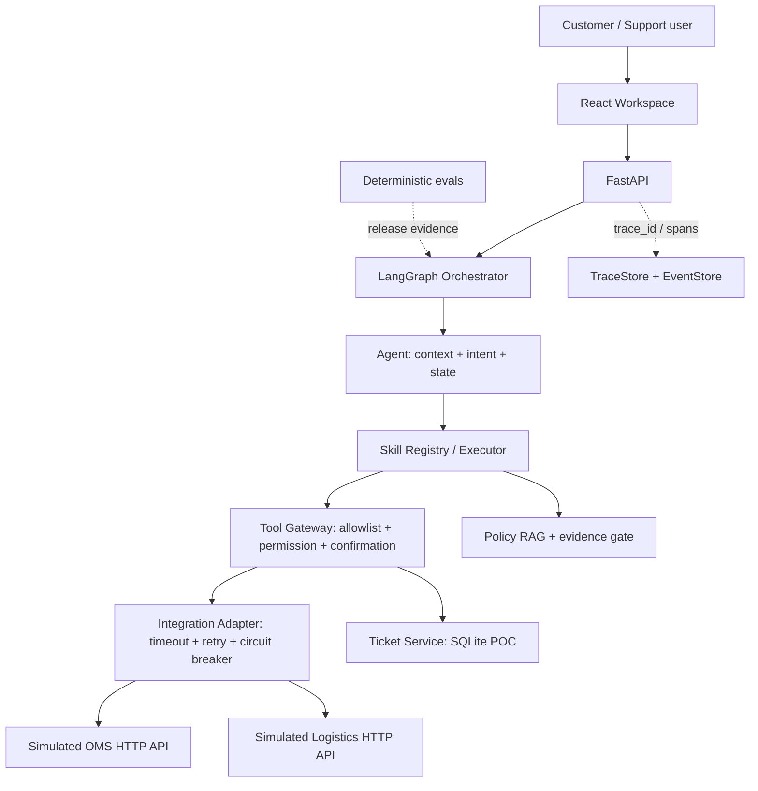

# AI Support Delivery

[](https://github.com/jonji886/ai-support-delivery/actions/workflows/ci.yml)

> Forward Deployed AI / AI Agent Delivery Portfolio

一个模拟企业 AI Agent 交付过程的跨境电商售后 POC：从 Customer Discovery、自动化范围定义，到 OMS / Logistics 集成、Agent Safety、故障排查、Evaluation、POC Acceptance 和 Handoff。

本仓库展示的是交付方法和可验证工程证据，不是某个真实客户的生产系统。订单、业务基线、接口和评测数据均为 `Simulated` / `Illustrative`。

## Project Overview

客户售后团队需要在 OMS、物流系统、规则库和工单队列之间切换。低风险、高频问题适合自动化；投诉、支付敏感、规则无依据和外部系统故障则必须停止猜测并转人工。

```text
Customer problem
  → Discovery and scope
  → Agent / Skill / Tool solution
  → Customer-system integration
  → Safety and human handoff
  → Evaluation and acceptance
  → Runbook and delivery handoff
```

核心架构刻意保持简单：`Agent → Skill → Tool → Integration Adapter`。模型理解用户，Tool 和客户系统证明业务事实，人工处理例外。

## Demo

### 1. Normal inquiry — read-only fact lookup

```text
User: 订单 OD202608001 到哪里了？
Agent: logistics_inquiry Skill
      → query_order_logistics Tool
      → OMS + Logistics HTTP Adapter
      → 返回“运输中”、最新节点、预计到达时间、trace_id
```

### 2. Return request — confirmation before write

```text
User: 我想退货，订单是 OD202608001
Agent: 收集退货原因 → check_return_eligibility（只读）
      → 返回资格判断 → 等待用户明确确认
User: 确认提交退货申请
Agent: permission check → idempotency check
      → submit_return_application（写操作）→ 待审核
```

写操作不会因为模型输出了一个“确认”就直接执行；确认、权限、订单归属和幂等校验都在 Tool 执行边界再次检查。

### 3. Complaint / escalation — stop automation

```text
User: 我已经问了三次，一直不退款，我要投诉
Agent: complaint / risk signal
      → 停止普通业务 Tool
      → create_service_ticket
      → 人工队列 + 上下文摘要
```

### 4. Trace / evaluation evidence

每个 `/assist` 请求返回 `trace_id`；Supervisor 可以查看 `graph.* → skill.* → tool.* / rag.*` 子 Span、错误码、耗时和处理结果。固定评测脚本会验证 Tool 权限、引用、转人工和状态流转，而不是只检查回答中是否出现某个字符串。

> Visual evidence status: 本轮没有提交伪造截图。当前环境没有可用浏览器运行时，`docs/assets/` 仅作为后续真实截图的位置；现阶段以可复现 API 场景、Trace 和评测报告作为证据。

## Customer Problem

这是一个 `Simulated enterprise delivery` 场景，不代表真实客户数据。

| 观察到的问题 | 交付含义 |
|---|---|
| 物流查询重复、频率高、事实来自外部系统 | 优先做只读自动化，答案必须来自 OMS / Logistics Tool |
| 退货判断同时依赖订单状态、签收时间和规则 | 自动判断可以做，但提交申请必须再次确认 |
| 投诉、退款争议、支付敏感错误成本高 | 默认停止自动处置，创建工单并交给人工 |
| 外部系统字段和错误契约不稳定 | 用 Adapter + Canonical Model 隔离客户系统差异 |
| “评测 100%”容易被误读为生产准确率 | 分离 deterministic regression、challenge 和生产限制 |

## POC Scope

### In scope

- 物流查询：订单归属校验后查询 OMS / Logistics，并返回受控物流事实。
- 退货资格判断：基于订单状态、签收时间、品类和规则判断；资格通过后等待确认。
- 退货申请提交：用户明确确认后执行受控写 Tool，返回申请号和“待审核”状态。
- 规则问答：生命周期过滤、混合检索、证据门禁和片段级引用。
- 投诉、支付敏感、低置信度和依赖故障：创建工单、生成摘要、人工接管。
- 本地 Trace / Event、固定评测、Mock Customer Systems、Docker Compose 和交接文档。

### Out of scope

- 真实客户 OMS、物流商、ERP、支付或生产工单系统。
- 真实个人信息、真实订单、真实退款和真实 ROI / SLA。
- 支付修改、退款审批、不可逆高风险操作的自主执行。
- 生产级认证、多租户、数据库高可用、外部告警和浏览器 E2E。

## Automation Decision Matrix

自动化程度按频率、错误成本和数据确定性决定，不以“Agent 能不能调用 Tool”为唯一标准。

| Scenario | Frequency | Error cost | Data certainty | Automation decision |
|---|---:|---:|---:|---|
| Logistics inquiry | High | Low | High | Auto read-only lookup |
| Return eligibility | High | Medium | High | Auto decision with rule evidence |
| Submit return | Medium | Medium | High | Confirm before write |
| Policy Q&A | Medium | Medium | Depends on evidence | Answer only with valid citation; otherwise handoff |
| Complaint / refund dispute | Medium | High | Low / disputed | Human handoff |
| Payment-sensitive request | Low | Critical | — | Never auto-execute |

## Solution Architecture



架构中的 `Agent → Skill → Tool` 边界保持不变：Agent 选择场景，Skill 管理槽位、流程、权限和降级，Tool 执行原子业务动作。LLM 不拥有订单状态、物流状态或退货资格的最终决定权。

## End-to-End Scenarios

| Scenario | Skill | Tool / source | Safe outcome |
|---|---|---|---|
| 查物流 | `logistics_inquiry` | `query_order_logistics` → OMS + Logistics | 返回最新受控状态；找不到或失败则说明无法确认并转人工 |
| 判断退货 | `return_resolution` | `check_return_eligibility` → order + policy | 返回规则依据和下一步；争议/异常进入人工 |
| 提交退货 | `return_resolution` | `submit_return_application` | 仅确认后写入，幂等返回申请号和待审核状态 |
| 规则问答 | `policy_qa` | `search_policy` | 有有效引用才回答；无证据拒答并转人工 |
| 投诉/支付敏感 | `risk_handoff` | `create_service_ticket` | 停止普通自动化，按风险类别创建工单 |

## Customer System Integration

Agent 不直接读取客户 JSON，也不把客户字段名暴露给 Skill。当前 POC 的真实链路是：

```text
Customer OMS / Logistics HTTP API
    ↓
CustomerSystemClient
    ↓
IntegrationAdapter
    ↓
Field Mapper → Canonical domain model
    ↓
query_order_logistics Tool
    ↓
logistics_inquiry Skill
    ↓
Agent response
```

### Canonical mapping example

| Canonical field | Customer system field | Mapping |
|---|---|---|
| `order_id` | `order_no` | direct |
| `anonymous_user_id` | `customer_ref` | direct |
| `order_status` | `fulfillment_status` | `DELIVERED` → `已签收` |
| `category` | `category_code` | `STANDARD_GOODS` → `standard_goods` |
| `signed_at` | `signed_at` | direct |
| `logistics.carrier` | `carrier_code` | `DEMO_EXPRESS` → `Demo Express` |
| `logistics.latest_event` | `tracking_events[-1]` | `event_time/location/description` → canonical event |
| `logistics.exception` | `has_exception` | boolean normalization |
| `logistics.estimated_arrival` | `eta` | direct |

这些字段和枚举来自 [`apps/api/support/mappers.py`](apps/api/support/mappers.py) 及 `data/mock/customer/`。Ticket 在当前 POC 中是本地 SQLite Service；没有把不存在的 SCRM / Ticket API 写成已接入能力。真实客户接入时，只需要替换 Client / Adapter / Mapper 的边界，Skill 不应感知 `order_no` 或 `fulfillment_status` 这类客户命名。

## Safety & Human-in-the-loop

```text
LLM / Agent
  → Skill allowlist
  → Tool permission check
  → user / order ownership check
  → business validation
  → explicit confirmation for writes
  → idempotency key
  → audit event + trace_id
  → business system
```

- LLM 输出是不可信输入；实时业务事实来自 Tool / Customer System。
- Skill Executor 检查 `allowed_tools` / `forbidden_tools`，`finalize` 再做意图与 Tool 权限校验。
- 订单查询和写操作均校验用户归属；写操作未确认时返回受控确认状态，不执行回调。
- 投诉、支付敏感、低置信度、无依据知识和外部依赖故障都走人工路径。
- “退货申请待审核”不等于“退款完成”；最终审核仍属于人工队列。

## Failure Handling & Observability

Integration Adapter 已实现 timeout、只读 retry、circuit breaker、标准错误码和确定性 fault injection。系统不会在 OMS 失败时猜一个物流状态：它返回受控失败、记录 trace，并把用户带到人工路径。

```text
User logistics inquiry
  → query_order_logistics
  → OMS timeout
  → read retry
  → 504_EXTERNAL_TIMEOUT / circuit state
  → safe response + human handoff
  → trace: graph → skill → tool, with error code and latency
```

可重复运行：

```bash
make demo-oms-timeout
```

该命令启动本地 Mock OMS / Logistics 和 API，向客户系统注入 `timeout`，打印用户可见响应和 Trace 子 Span。详见 [Simulated OMS Timeout Incident](docs/incident-debugging-case.md)。

## Evaluation & Acceptance

当前报告来自本地 deterministic POC 数据，不是客户生产结果：

| Evaluation suite | Purpose | Current result |
|---|---|---:|
| Core regression | 发布前核心业务契约 | 58/58, 100% |
| Intent Catalog | 路由、混淆边界、高风险召回 | 60/60, high-risk recall 100% |
| Skill selection / execution | 场景选择与内部流程 | 16/16；13/13 |
| RAG regression | 固定知识回归、引用和拒答 | 40/40, 100% |
| RAG challenge | 未见表达和长尾泛化 | 76.67% |
| Working Memory | TTL、纠正、隔离、陈旧状态 | 12/12, 100% |
| Extended Memory | continuity、preference、pollution、token cost | 9/9, 100% |

按当前 JSON 报告口径合计 268 条检查：RAG 三个数据集共 100 条，Memory 基础与扩展共 21 条。发布门禁保留在 CI：核心 ≥ 85%、Intent ≥ 95% 且高风险召回 100%、Skill 关键违规为 0、RAG 固定回归 ≥ 90%、跨用户泄露/陈旧状态/Memory 污染为 0。

### How to read the numbers

`100% deterministic regression ≠ 100% production accuracy`。

- 固定回归集证明已知业务契约没有回归，不证明未知表达都能正确处理。
- RAG Challenge 当前 76.67%，明确暴露了 POC 的泛化缺口；它不是 CI blocking gate。
- 意图和 Skill 专项主要证明确定性安全路由与 manifest 契约；真实模型需要按 `model / prompt_version / dataset_version` 单独评测。
- 当前 RAG 使用 deterministic test embedding / reranker，Mock Customer Systems 不代表真实接口时延、容量或数据质量。
- 真实流量上线前仍需补充生产基线、认证授权、数据隔离、灰度、回滚和线上观测。

完整结果见 [POC Acceptance Report](docs/poc-acceptance-report.md) 和 [Evaluation & Badcase](docs/evaluation-and-badcase.md)。

## Delivery Lifecycle


对应交付物：

| Stage | Evidence |
|---|---|
| Discovery / Scope | [Customer Discovery](docs/customer-discovery.md)、[SPEC](SPEC.md) |
| Solution | [Solution Design](docs/solution-design.md)、[API Contracts](docs/api-contracts.md)、[ADR](docs/adr/) |
| Evaluation / Acceptance | [Evaluation & Badcase](docs/evaluation-and-badcase.md)、[POC Acceptance](docs/poc-acceptance-report.md) |
| Deployment / Handoff | [Delivery Playbook](docs/delivery-playbook.md)、[Deployment Runbook](docs/deployment-runbook.md)、[Cloud Deployment](docs/cloud-deployment.md) |
| Interview walkthrough | [Portfolio Walkthrough](docs/portfolio-walkthrough.md) |

## Quick Start

### Local development

Requirements: Python 3.9+、Node.js 20+。所有数据为本地模拟数据，默认不需要真实模型密钥。

```bash
# Terminal 1: simulated customer systems
python3 -m uvicorn apps.mock_customer_systems.app:app --port 8001

# Terminal 2: API
python3 -m pip install -r requirements.txt
MOCK_CUSTOMER_SYSTEMS_BASE_URL=http://127.0.0.1:8001 \
DEEPSEEK_ENABLED=false \
  make dev

# Terminal 3: web
cd apps/web
npm install
npm run dev
```

打开 `http://localhost:5173`。Docker Compose 方式见 [Deployment Runbook](docs/deployment-runbook.md)。

### Verification

```bash
make lint
make test
make eval
cd apps/web && npm run build
```

CI 不连接 DeepSeek 或其他付费模型；真实模型评测如果启用，应单独运行，不能替代 deterministic gate。

## Known Limitations

| Area | Current POC boundary |
|---|---|
| Customer systems | HTTP Mock OMS / Logistics；字段映射边界已验证，未连接真实 API |
| Identity | 模拟 `X-User-Id` / `X-Role`，没有客户 JWT/OAuth 和多租户治理 |
| Persistence | SQLite 单文件；生产需要迁移、备份、并发和租户隔离 |
| Reliability | Circuit breaker 为单进程内存状态；没有共享状态和生产级队列 |
| RAG | 内存线性扫描 + deterministic provider；未验证真实索引容量和模型效果 |
| LLM evaluation | 当前发布门禁不调用真实模型；没有线上流量泛化结论 |
| Observability | 本地 SQLite Trace/Event；没有外部采集器、告警、采样和保留策略 |
| UI | React 演示工作台；当前未完成浏览器级 E2E、真实登录和客服自动分配 |
| Deployment | Docker / 云部署方案已文档化，但本地验证环境未执行真实云部署 |

## Deep Dive Documentation

- [SPEC.md](SPEC.md)：需求、边界、权限、状态流转和验收标准
- [Customer Discovery](docs/customer-discovery.md)：模拟客户背景、流程、基线、风险和开放问题
- [Solution Design](docs/solution-design.md)：Agent / Skill / Tool、信任边界、集成和可观测性
- [Evaluation & Badcase](docs/evaluation-and-badcase.md)：数据集分层、门禁和问题归因
- [POC Acceptance Report](docs/poc-acceptance-report.md)：当前真实评测结果与未验证项
- [Incident Debugging Case](docs/incident-debugging-case.md)：模拟 FDE 故障排查、证据和客户沟通
- [Delivery Playbook](docs/delivery-playbook.md)：Discovery → Scope → POC → Evaluation → Handoff
- [Deployment Runbook](docs/deployment-runbook.md)：启动、配置、排障和回滚
- [Portfolio Walkthrough](docs/portfolio-walkthrough.md)：面试时的 5 分钟讲解路径
- [API Contracts](docs/api-contracts.md)：API、Tool、错误、权限和幂等契约
- [Memory Design](docs/memory-design.md)：结构化短期状态和多层 Memory 设计
- [ADR](docs/adr/)：为什么使用受控编排、证据门禁、版本化意图和 Skill 层

## Technology Snapshot

React 18 + TypeScript + Vite · FastAPI · LangGraph · SQLite · RAG · deterministic evaluation · Docker Compose。技术栈是实现手段，交付边界和可验证证据才是本项目的重点。

## License

[MIT](LICENSE)
