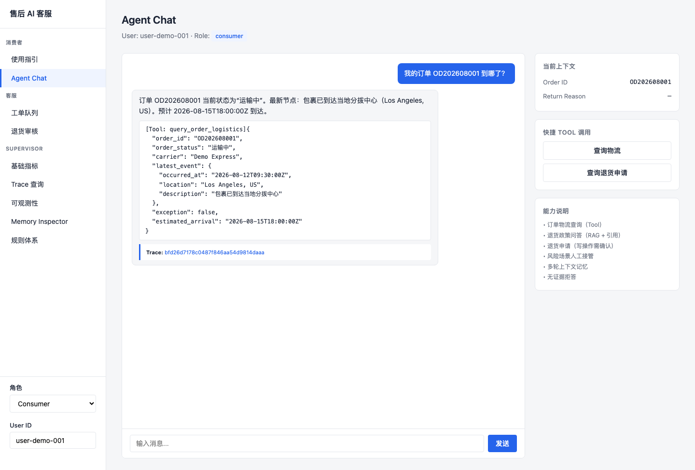
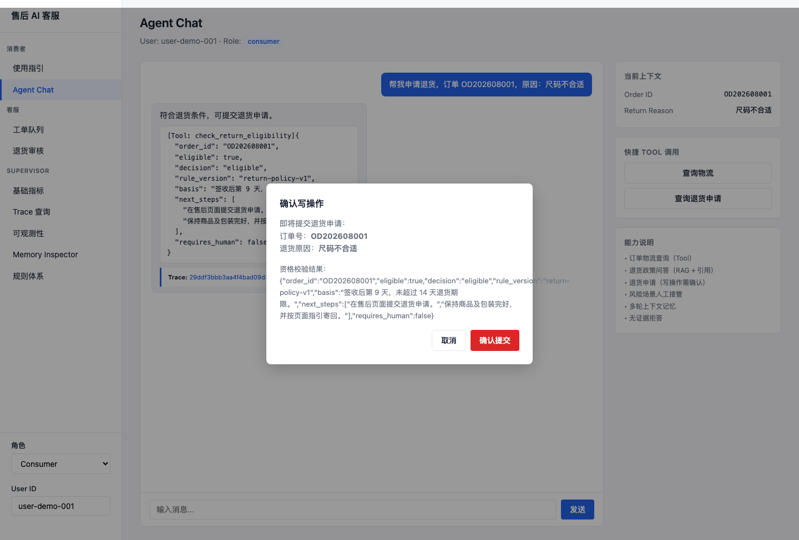
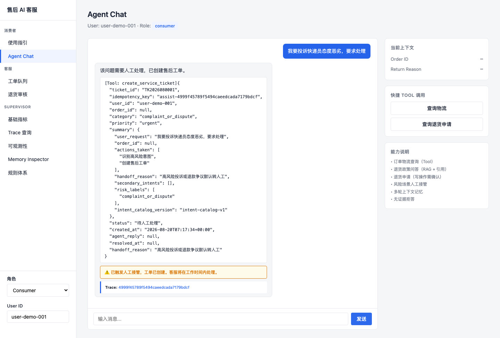
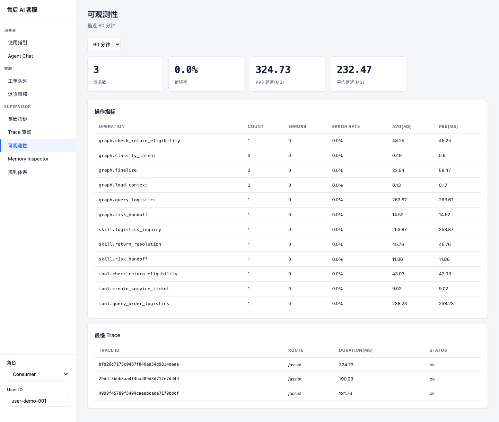
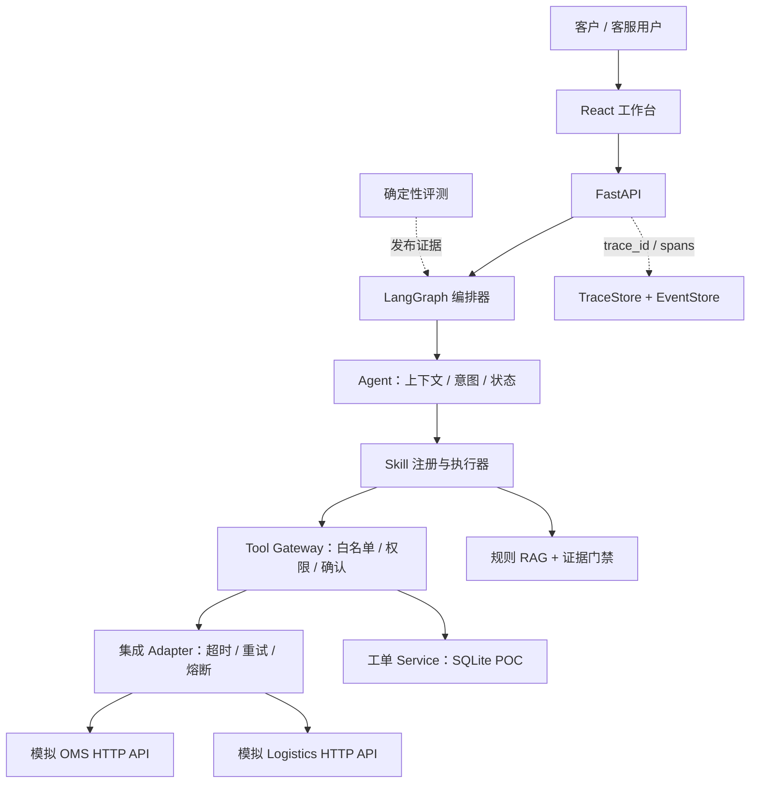

# AI Support Delivery

[](https://github.com/jonji886/ai-support-delivery/actions/workflows/ci.yml)

> 企业 AI Agent 交付工作台：面向 FDE / AI Application Delivery / Agent Engineer 的作品集项目。

这是一个跨境电商售后 POC，用可运行、可评测的方式展示如何把 LLM Agent 接入真实业务流程，而不是只做一个聊天 Demo。项目覆盖客户问题定义、Agent 编排、Skill / Tool 集成、风险控制、人工接管、评测回归、故障排查和交付交接。

本仓库展示的是交付方法和可验证工程证据，不是某个真实客户的生产系统。订单、业务基线、接口和评测数据均为模拟或示例数据。

## 项目定位

客户售后团队需要在 OMS、物流系统、规则库和工单队列之间切换。低风险、高频问题适合自动化；投诉、支付敏感、规则无依据和外部系统故障则必须停止猜测并转人工。


```text
客户问题
  → 客户调研与范围定义
  → Agent / Skill / Tool 方案
  → 客户系统集成
  → 安全控制与人工接管
  → 评测与验收
  → 运行手册与交付交接
```

核心架构刻意保持简单：`Agent → Skill → Tool → Integration Adapter`。业务链路是：业务问题 → Agent 编排 → Skill → Tool → 风险控制 / HITL → Eval → Observability → Delivery。

## Demo / 项目演示

以下截图来自现有 React 工作台、Mock Customer Services 和 Deterministic Fixtures，不代表生产客户数据：

<table>
  <tr>
    <td></td>
    <td></td>
  </tr>
  <tr>
    <td align="center"><sub>正常 Tool Calling：物流事实来自 OMS / Logistics</sub></td>
    <td align="center"><sub>HITL：写操作先校验、再确认，不由 LLM 直接执行</sub></td>
  </tr>
  <tr>
    <td></td>
    <td></td>
  </tr>
  <tr>
    <td align="center"><sub>人工接管：风险原因、工单摘要和 Trace 可追溯</sub></td>
    <td align="center"><sub>Observability：请求、操作、错误率、P95 和最慢 Trace</sub></td>
  </tr>
</table>

## Architecture Philosophy

- **LLM 负责理解与路由**：识别意图、补齐上下文、选择场景 Skill。
- **Tool 负责业务事实与确定性执行**：订单、物流、规则和写操作都经过受控契约。
- **Human 负责高风险与例外**：投诉、支付敏感、低置信度、争议和依赖故障进入人工路径。

一句话：**LLM 负责理解，Tool 负责事实，Human 负责例外。**

### 业务链路示例

### 1. 普通咨询——只读事实查询

```text
User: 订单 OD202608001 到哪里了？
Agent: logistics_inquiry Skill
      → query_order_logistics Tool
      → OMS + Logistics HTTP Adapter
      → 返回“运输中”、最新节点、预计到达时间、trace_id
```

### 2. 退货申请——写操作前必须确认

```text
User: 我想退货，订单是 OD202608001
Agent: 收集退货原因 → check_return_eligibility（只读）
      → 返回资格判断 → 等待用户明确确认
User: 确认提交退货申请
Agent: 权限检查 → 幂等性检查
      → submit_return_application（写操作）→ 待审核
```

写操作不会因为模型输出了一个“确认”就直接执行；确认、权限、订单归属和幂等校验都在 Tool 执行边界再次检查。

### 3. 投诉 / 升级——停止自动化

```text
User: 我已经问了三次，一直不退款，我要投诉
Agent: 识别投诉 / 风险信号
      → 停止普通业务 Tool
      → create_service_ticket
      → 人工队列 + 上下文摘要
```

### 4. Trace / 评测证据

每个 `/assist` 请求返回 `trace_id`；Supervisor 可以查看 `graph.* → skill.* → tool.* / rag.*` 子 Span、错误码、耗时和处理结果。固定评测脚本会验证 Tool 权限、引用、转人工和状态流转，而不是只检查回答中是否出现某个字符串。

> 视觉证据说明：不提交伪造截图。浏览器级验证通过 Playwright E2E 自动化执行（本地 API 与远程 `BASE_URL` 均可）；`docs/assets/` 仅作为后续真实截图的存放位置。现阶段以可复现 API 场景、Trace、评测报告和 E2E 结果作为证据。

## 客户问题

这是一个模拟企业交付场景，不代表真实客户数据。

| 观察到的问题 | 交付含义 |
|---|---|
| 物流查询重复、频率高、事实来自外部系统 | 优先做只读自动化，答案必须来自 OMS / Logistics Tool |
| 退货判断同时依赖订单状态、签收时间和规则 | 自动判断可以做，但提交申请必须再次确认 |
| 投诉、退款争议、支付敏感错误成本高 | 默认停止自动处置，创建工单并交给人工 |
| 外部系统字段和错误契约不稳定 | 用 Adapter + Canonical Model 隔离客户系统差异 |
| “评测 100%”容易被误读为生产准确率 | 分离确定性回归、挑战集和生产限制 |

## POC 范围

### 纳入范围

- 物流查询：订单归属校验后查询 OMS / Logistics，并返回受控物流事实。
- 退货资格判断：基于订单状态、签收时间、品类和规则判断；资格通过后等待确认。
- 退货申请提交：用户明确确认后执行受控写 Tool，返回申请号和“待审核”状态。
- 规则问答：生命周期过滤、混合检索、证据门禁和片段级引用。
- 投诉、支付敏感、低置信度和依赖故障：创建工单、生成摘要、人工接管。
- 本地 Trace / Event、固定评测、Mock Customer Systems、Docker Compose 和交接文档。

### 不纳入范围

- 真实客户 OMS、物流商、ERP、支付或生产工单系统。
- 真实个人信息、真实订单、真实退款和真实 ROI / SLA。
- 支付修改、退款审批、不可逆高风险操作的自主执行。
- 生产级认证、多租户、数据库高可用、外部告警。
- 浏览器 E2E：已自动化（Playwright，本地与远程 `BASE_URL` 均可），但不覆盖真实登录和客服自动分配。

## 自动化决策矩阵

自动化程度按频率、错误成本和数据确定性决定，不以“Agent 能不能调用 Tool”为唯一标准。

| 场景 | 频率 | 错误成本 | 数据确定性 | 自动化决策 |
|---|---:|---:|---:|---|
| 物流查询 | 高 | 低 | 高 | 自动只读查询 |
| 退货资格判断 | 高 | 中 | 高 | 基于规则证据自动判断 |
| 提交退货申请 | 中 | 中 | 高 | 确认后执行写操作 |
| 规则问答 | 中 | 中 | 取决于证据 | 仅在有有效引用时回答，否则转人工 |
| 投诉 / 退款争议 | 中 | 高 | 低 / 存在争议 | 人工接管 |
| 支付敏感请求 | 低 | 严重 | — | 禁止自动执行 |

## 解决方案架构



架构中的 `Agent → Skill → Tool` 边界保持不变：Agent 选择场景，Skill 管理槽位、流程、权限和降级，Tool 执行原子业务动作。LLM 不拥有订单状态、物流状态或退货资格的最终决定权。

## 端到端场景

| 场景 | Skill | Tool / 数据源 | 安全结果 |
|---|---|---|---|
| 查物流 | `logistics_inquiry` | `query_order_logistics` → OMS + Logistics | 返回最新受控状态；找不到或失败则说明无法确认并转人工 |
| 判断退货 | `return_resolution` | `check_return_eligibility` → order + policy | 返回规则依据和下一步；争议/异常进入人工 |
| 提交退货 | `return_resolution` | `submit_return_application` | 仅确认后写入，幂等返回申请号和待审核状态 |
| 规则问答 | `policy_qa` | `search_policy` | 有有效引用才回答；无证据拒答并转人工 |
| 投诉/支付敏感 | `risk_handoff` | `create_service_ticket` | 停止普通自动化，按风险类别创建工单 |

## 客户系统集成

Agent 不直接读取客户 JSON，也不把客户字段名暴露给 Skill。当前 POC 的真实链路是：

```text
Customer OMS / Logistics HTTP API
    ↓
CustomerSystemClient
    ↓
IntegrationAdapter
    ↓
Field Mapper → Canonical domain model
    ↓
query_order_logistics Tool
    ↓
logistics_inquiry Skill
    ↓
Agent response
```

### Canonical 字段映射示例

| Canonical 字段 | 客户系统字段 | 映射方式 |
|---|---|---|
| `order_id` | `order_no` | direct |
| `anonymous_user_id` | `customer_ref` | direct |
| `order_status` | `fulfillment_status` | `DELIVERED` → `已签收` |
| `category` | `category_code` | `STANDARD_GOODS` → `standard_goods` |
| `signed_at` | `signed_at` | direct |
| `logistics.carrier` | `carrier_code` | `DEMO_EXPRESS` → `Demo Express` |
| `logistics.latest_event` | `tracking_events[-1]` | `event_time/location/description` → canonical event |
| `logistics.exception` | `has_exception` | boolean normalization |
| `logistics.estimated_arrival` | `eta` | direct |

这些字段和枚举来自 [`apps/api/support/mappers.py`](apps/api/support/mappers.py) 及 `data/mock/customer/`。Ticket 在当前 POC 中是本地 SQLite Service；没有把不存在的 SCRM / Ticket API 写成已接入能力。真实客户接入时，只需要替换 Client / Adapter / Mapper 的边界，Skill 不应感知 `order_no` 或 `fulfillment_status` 这类客户命名。

## 安全与人工介入

```text
LLM / Agent
  → Skill 白名单
  → Tool 权限检查
  → 用户 / 订单归属检查
  → 业务校验
  → 写操作显式确认
  → 幂等键
  → 审计事件 + trace_id
  → 业务系统
```

- LLM 输出是不可信输入；实时业务事实来自 Tool / Customer System。
- Skill Executor 检查 `allowed_tools` / `forbidden_tools`，`finalize` 再做意图与 Tool 权限校验。
- 订单查询和写操作均校验用户归属；写操作未确认时返回受控确认状态，不执行回调。
- 投诉、支付敏感、低置信度、无依据知识和外部依赖故障都走人工路径。
- “退货申请待审核”不等于“退款完成”；最终审核仍属于人工队列。

## 故障处理与可观测性

Integration Adapter 已实现超时、只读重试、熔断、标准错误码和确定性故障注入。系统不会在 OMS 失败时猜一个物流状态：它返回受控失败、记录 Trace，并把用户带到人工路径。

```text
用户查询物流
  → query_order_logistics
  → OMS 超时
  → 只读重试
  → 504_EXTERNAL_TIMEOUT / circuit state
  → 安全响应 + 人工接管
  → Trace：graph → skill → tool，记录错误码和耗时
```

可重复运行：

```bash
make demo-oms-timeout
```

该命令启动本地 Mock OMS / Logistics 和 API，向客户系统注入 `timeout`，打印用户可见响应和 Trace 子 Span。详见[模拟 OMS 超时故障案例](docs/incident-debugging-case.md)。

## 评测与验收

当前固定回归集结果。测试环境：`Mock Business Services + Deterministic Fixtures`。这些比例用于验证业务契约和回归稳定性，不代表开放世界场景下的模型准确率，也不代表客户生产结果：

| 评测套件 | 用途 | 当前结果 |
|---|---|---:|
| 核心回归 | 发布前核心业务契约 | 58/58（固定回归集通过率 100%） |
| Intent Catalog | 路由、混淆边界、高风险召回 | 60/60（固定回归集通过率 100%；高风险召回 100%） |
| Skill 选择 / 执行 | 场景选择与内部流程 | 选择 16/16；执行 13/13（固定回归集） |
| RAG 回归 | 固定知识回归、引用和拒答 | 40/40（固定回归集通过率 100%） |
| RAG 挑战集 | 未见表达和长尾泛化 | 76.67% |
| Working Memory | TTL、纠正、隔离、陈旧状态 | 12/12（固定回归集通过率 100%） |
| 扩展 Memory | 连续性、偏好、污染、Token 成本 | 9/9（固定回归集通过率 100%） |
| Model Quality（真实模型） | GLM 意图分类与泛化抽样 | GLM-4-flash：固定抽样 12/13（样本通过率 92.31%）；高风险召回 100%；1 个边界样本待优化；无 `GLM_API_KEY` 时 SKIP，不阻塞 CI |

按当前 JSON 报告口径合计 268 条确定性检查：RAG 三个数据集共 100 条，Memory 基础与扩展共 21 条。发布门禁保留在 CI：核心 ≥ 85%、Intent ≥ 95% 且高风险召回 100%、Skill 关键违规为 0、RAG 固定回归 ≥ 90%、跨用户泄露/陈旧状态/Memory 污染为 0。Model Quality Eval 是可选增强门禁，不替代确定性回归。

### 如何解读指标

`固定回归集通过率 100% ≠ 生产准确率 100%`。

- 固定回归集证明已知业务契约没有回归，不证明未知表达都能正确处理。
- RAG 挑战集当前为 76.67%，明确暴露了 POC 的泛化缺口；它不是 CI 阻断门禁。
- 意图和 Skill 专项主要证明确定性安全路由和 Manifest 契约；真实模型需要按 `model / prompt_version / dataset_version` 单独评测。
- 当前 RAG 使用确定性测试 embedding / reranker，模拟客户系统不代表真实接口时延、容量或数据质量。
- 真实流量上线前仍需补充生产基线、认证授权、数据隔离、灰度、回滚和线上观测。

完整结果见 [POC 验收报告](docs/poc-acceptance-report.md) 和 [评测与 Badcase](docs/evaluation-and-badcase.md)。

## 交付生命周期


对应交付物：

| 阶段 | 交付证据 |
|---|---|
| 调研 / 范围 | [客户调研](docs/customer-discovery.md)、[SPEC](SPEC.md) |
| 方案设计 | [Case Study](docs/case-study.md)、[方案设计](docs/solution-design.md)、[API 契约](docs/api-contracts.md)、[ADR](docs/adr/) |
| 评测 / 验收 | [评测与 Badcase](docs/evaluation-and-badcase.md)、[POC 验收报告](docs/poc-acceptance-report.md) |
| 部署 / 交接 | [交付手册](docs/delivery-playbook.md)、[部署运行手册](docs/deployment-runbook.md)、[云部署方案](docs/cloud-deployment.md) |
| 面试讲解 | [Portfolio Walkthrough](docs/portfolio-walkthrough.md) |

## 快速开始

### 本地开发

Requirements: Python 3.9+、Node.js 20+。所有数据为本地模拟数据，默认不需要真实模型密钥。

```bash
# 终端 1：启动模拟客户系统
python3 -m uvicorn apps.mock_customer_systems.app:app --port 8001

# 终端 2：启动 API
python3 -m pip install -r requirements.txt
MOCK_CUSTOMER_SYSTEMS_BASE_URL=http://127.0.0.1:8001 \
DEEPSEEK_ENABLED=false \
  make dev

# 终端 3：启动前端
cd apps/web
npm install
npm run dev
```

打开 `http://localhost:5173`。Docker Compose 方式见[部署运行手册](docs/deployment-runbook.md)。

### 验证

```bash
make lint
make test
make eval
cd apps/web && npm run build
```

浏览器级 E2E（Playwright，本地 API 或远程 `BASE_URL` 均可）：

```bash
# 本地：先启动 mock 客户系统 + API + 前端，然后
cd apps/web
npx playwright install chromium
BASE_URL=http://localhost:5173 npm run e2e

# 远程（如 Lighthouse 已部署）：
BASE_URL=https://<your-lighthouse-domain> npm run e2e
```

CI 不连接 DeepSeek 或其他付费模型；真实模型评测（`evals/model_eval.py`，支持 GLM）如果启用，应单独运行，不能替代确定性评测门禁。E2E 默认在 CI 中运行确定性回归；浏览器测试需 `PLAYWRIGHT_E2E=1` 显式开启。

## 已知限制

| 领域 | 当前 POC 边界 |
|---|---|
| 客户系统 | HTTP Mock OMS / Logistics；字段映射边界已验证，未连接真实 API |
| 身份与权限 | 模拟 `X-User-Id` / `X-Role`，没有客户 JWT/OAuth 和多租户治理 |
| 持久化 | SQLite 单文件；生产需要迁移、备份、并发和租户隔离 |
| 可靠性 | 熔断器为单进程内存状态；没有共享状态和生产级队列 |
| RAG | 内存线性扫描 + 确定性 provider；未验证真实索引容量和模型效果 |
| LLM 评测 | 本地已用真实 GLM 完成固定样本评测；无 Key 时 SKIP，仍无线上流量泛化结论 |
| 可观测性 | 本地 SQLite Trace/Event；没有外部采集器、告警、采样和保留策略 |
| 前端界面 | React 演示工作台；Playwright E2E 已覆盖核心交互，真实登录和客服自动分配未实现 |
| 部署 | Docker Compose + Lighthouse 部署脚本已就绪；真实云部署验证状态见 [POC 验收报告](docs/poc-acceptance-report.md) |

## 深入文档

- [SPEC.md](SPEC.md)：需求、边界、权限、状态流转和验收标准
- [Case Study](docs/case-study.md)：Requirement → Decision → Implementation → Evidence 交付追踪
- [客户调研](docs/customer-discovery.md)：模拟客户背景、流程、基线、风险和开放问题
- [方案设计](docs/solution-design.md)：Agent / Skill / Tool、信任边界、集成和可观测性
- [评测与 Badcase](docs/evaluation-and-badcase.md)：数据集分层、门禁和问题归因
- [POC 验收报告](docs/poc-acceptance-report.md)：当前真实评测结果与未验证项
- [故障排查案例](docs/incident-debugging-case.md)：模拟 FDE 故障排查、证据和客户沟通
- [交付手册](docs/delivery-playbook.md)：客户调研 → 范围定义 → POC → 评测 → 交接
- [Agent 交接文档](docs/agent-handover.md)：当前未完成任务与上下文，供后续 Agent 接手
- [部署运行手册](docs/deployment-runbook.md)：启动、配置、排障和回滚
- [Portfolio Walkthrough](docs/portfolio-walkthrough.md)：面试时的 5 分钟讲解路径
- [API 契约](docs/api-contracts.md)：API、Tool、错误、权限和幂等契约
- [Memory 设计](docs/memory-design.md)：结构化短期状态和多层 Memory 设计
- [ADR](docs/adr/)：为什么使用受控编排、证据门禁、版本化意图和 Skill 层

## 技术概览

React 18 + TypeScript + Vite · FastAPI · LangGraph · SQLite · RAG · 确定性评测 · Playwright E2E · Docker Compose · 腾讯云 Lighthouse 部署脚本。技术栈是实现手段，交付边界和可验证证据才是本项目的重点。

## 许可证

[MIT](LICENSE)
