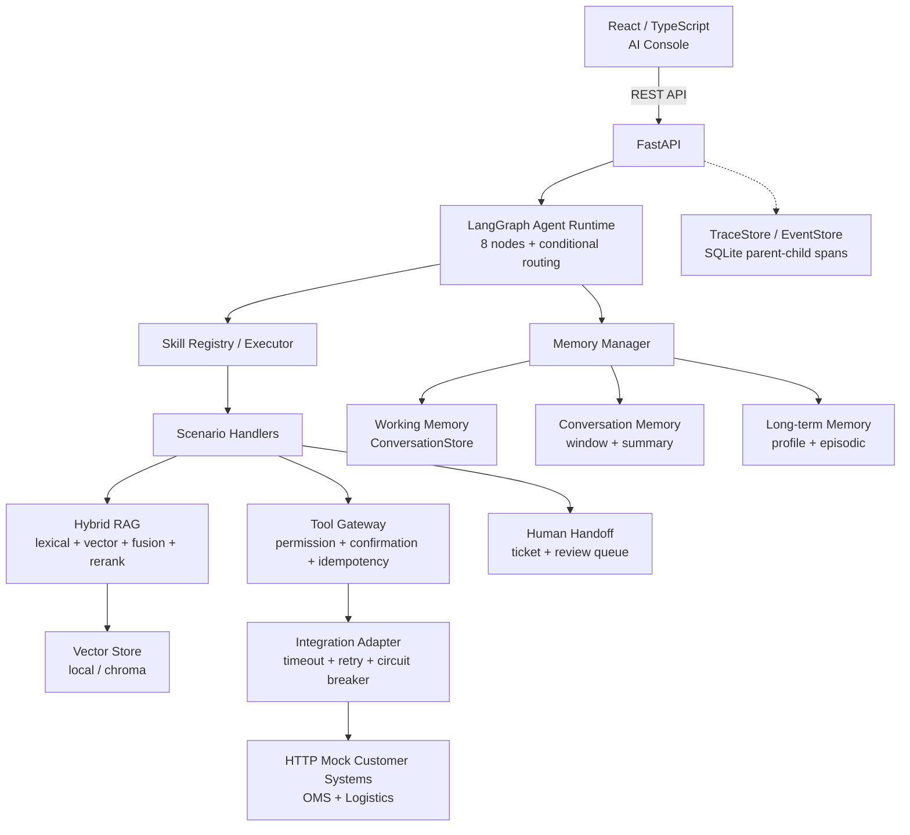

# AI Support Delivery

[](https://github.com/jonji886/ai-support-delivery/actions/workflows/ci.yml)

> 一个面向跨境电商售后的全栈 Agent 产品，演示 React + FastAPI + LangGraph + RAG + Memory + Tool Use + Human-in-the-loop 的完整 AI 应用工程链路。

**项目定位**：AI Engineer / Agent Engineer 全栈作品集

**核心技术**：React 18 · TypeScript · Vite · FastAPI · LangGraph · Agent/Skill/Tool · RAG · Memory System · Vector Store · Tool Use · Human-in-the-loop · Eval · Observability · Docker · MCP

---

## 30 秒了解

```
消费者提问 → Agent 理解意图 → Skill 选择流程 → Tool 验证事实 → 返回带引用的回答
                                                    ↓
                                         高风险？→ 人工接管 + 工单
```

这不是一个简单的 Chatbot Demo。它是一个完整的 AI 产品工程：

- **全栈**：React 前端 + FastAPI 后端 + Docker 部署
- **Agent**：LangGraph 显式状态图，8 节点 + 条件路由
- **RAG**：lexical/vector/fusion/rerank 四策略 + 证据门禁 + 引用
- **Memory**：Working Memory + Conversation Memory + Long-term Memory + Inspector
- **Tool Use**：权限白名单 + 写操作确认 + 幂等键
- **Human-in-the-loop**：风险场景自动转人工 + 工单 + 客服审核
- **Eval**：5 个评测集，271 条用例，CI 门禁
- **Observability**：SQLite 父子 Span Trace + 指标看板
- **Docker**：一键 `docker compose up --build`

---

## What It Demonstrates

| 能力 | 技术栈 | 证据 |
|---|---|---|
| **React 全栈前端** | React 18 + TypeScript + Vite | `apps/web/` — 8 页面 + 组件化 |
| **FastAPI 后端** | Python + FastAPI + Pydantic | `apps/api/main.py` — REST API |
| **LangGraph Agent** | LangGraph 显式状态图 | `apps/api/agent/graph.py` — 8 节点 |
| **RAG** | Hybrid Retrieval + Rerank + Citation | `apps/api/services/policy_search.py` |
| **Memory System** | 3 类 Memory + Write Policy + Inspector | `apps/api/memory/` |
| **Tool Use** | 权限白名单 + 写操作确认 + 幂等 | `apps/api/skills/` |
| **Vector Search** | Local + Chroma Provider | `apps/api/support/vectorstore/` |
| **Human-in-the-loop** | 风险转人工 + 工单 + 审核 | `apps/api/skills/handlers.py` |
| **Eval** | 5 评测集 + CI 门禁 | `evals/` |
| **Observability** | Trace + Metrics + Summary | `apps/api/support/observability.py` |
| **Docker** | Compose + 多阶段构建 + Health Check | `deploy/docker-compose.yml` |
| **MCP** | Read-only MCP Server | `apps/mcp/` |

---

## Architecture



### Agent / Skill / Tool 三层

```
Agent (LangGraph)     — 调度、路由、状态管理
  ↓
Skill (Registry)      — 场景流程封装（物流查询、退货解决、政策问答、风险转人工）
  ↓
Tool (Gateway)        — 原子操作 + 权限校验 + 写操作确认
```

**核心原则**：模型理解用户，业务 Tool 证明事实，人工处理例外。

---

## Memory Architecture

本项目实现了完整的 Memory System，而不是只在 README 上写一个 Memory 名词。

| Memory | 用途 | 生命周期 | 存储 | 策略 |
|---|---|---|---|---|
| **Working Memory** | 当前 Agent 执行的业务状态 | Request / TTL | ConversationStore | Strategy A |
| **Conversation Memory** | 最近对话窗口 + 摘要 | Session | MemoryStore | Strategy B |
| **Profile Memory** | 稳定用户偏好 | Long-term | MemoryStore | Strategy C |
| **Episodic Memory** | 历史事件摘要 | Long-term | MemoryStore | Strategy C |

### Memory 流程

```
User Message
   ↓
Memory Candidate Extraction (policy.py)
   ↓
Memory Policy — 是否值得保存？
   ├── 无价值闲聊 → Ignore
   └── 稳定事实 ↓
Conflict Resolution — 与旧 Memory 冲突？
   ├── 用户纠正 → 覆盖
   ├── 已存在相同 → 跳过
   └── 无冲突 → 写入
   ↓
Persist
```

### Memory != RAG != Tool

| 维度 | Memory | RAG | Tool |
|---|---|---|---|
| 保存什么 | 用户/会话上下文 | 共享知识库 | 实时业务事实 |
| 例子 | "用户偏好简洁回答" | "7天无理由退货政策" | "订单 OD001 物流状态" |
| 优先级 | 最低 | 中 | 最高 |

**关键**：Tool 返回的实时业务事实永远优先于 Memory 中的历史记录。

### Memory Inspector

Supervisor 页面可直接查看用户 Memory：

```
type: profile
key: preferred_response_style
value: "简洁"
source: user_explicit
confidence: 1.0
scope: user
status: active
```

更多设计见 [Memory Design](docs/memory-design.md)。

---

## RAG

```
Question
  ↓
Lifecycle Hard Filter (published + effective_date)
  ↓
Lexical Recall (keyword + ngram overlap)
  + Vector Recall (cosine similarity)
  ↓
RRF Fusion (reciprocal rank fusion)
  ↓
Rerank (cross-encoder / lexical reranker)
  ↓
Evidence Gate (answerability metadata)
  ├── 不足 → 404 拒答（不编造）
  └── 充分 ↓
Citation (policy_id + version + chunk_id + quoted_text)
```

支持 4 种检索策略：`lexical`、`vector`、`fusion`、`fusion_rerank`。

### Vector Store Provider

```
VECTOR_STORE_PROVIDER=local   # 测试默认，确定性内存
VECTOR_STORE_PROVIDER=chroma  # 生产运行，Chroma 向量数据库
```

---

## Evaluation

真实评测结果（非伪造）：

| 指标 | 结果 | 门禁 | 状态 |
|---|---:|---:|---|
| 核心场景通过率 | 58/58，100% | ≥ 85% | ✅ |
| 高风险转人工覆盖率 | 100% | 100% | ✅ |
| 意图目录固定集 | 60/60，100% | ≥ 95% | ✅ |
| Skill 选择准确率 | 16/16，100% | ≥ 95% | ✅ |
| Skill 执行通过率 | 13/13，100% | ≥ 95% | ✅ |
| 越权/未确认/重复写 | 0/0/0 | 0/0/0 | ✅ |
| RAG 回归集 | 100% | ≥ 90% | ✅ |
| Working Memory 场景 | 12/12，100% | 100% | ✅ |
| **Memory 扩展 Eval** | **12/12，100%** | **100%** | **✅** |
| 跨用户泄露率 | 0% | 0% | ✅ |
| Memory 污染率 | 0% | 0% | ✅ |
| 订单纠正准确率 | 100% | 100% | ✅ |

Memory Eval 覆盖 8 个维度：

1. **Context Continuity** — 多轮不重复询问
2. **User Isolation** — cross_user_leakage = 0
3. **Stale Memory** — 订单变化后旧事实不污染
4. **Correction** — 用户纠正后使用新值
5. **Long-term Preference** — 跨 session 偏好生效
6. **Conflict Resolution** — 用户纠正 > 旧 Memory
7. **Memory Pollution** — 闲聊不写入长期 Memory
8. **Token Cost** — window 模式 vs full_history（实测节省 ~50%）

---

## Reliability & Safety

### Integration Layer

| 能力 | 说明 |
|---|---|
| **Timeout** | 默认 3s，超时映射为 `EXTERNAL_TIMEOUT` |
| **Retry** | 只读操作指数退避；写操作靠幂等键 |
| **Circuit Breaker** | CLOSED → OPEN（连续 5 次失败）→ HALF_OPEN |
| **Error Mapping** | 原始异常映射为标准错误，不泄露给 Agent |
| **Fault Injection** | 确定性故障注入，`X-Fault-Inject` 请求头 / `?fault=` 参数驱动 |

### Write Operation Safety

```
写操作流程：
  用户请求 → 资格校验 → 409 确认请求 → 用户确认 → 幂等提交 → 结果返回
```

- 权限白名单：意图与 Tool 必须匹配
- 幂等键：防止重复提交
- 订单归属校验：用户只能操作自己的订单

---

## Deployment

### Docker Compose（本地一键启动）

```bash
cd deploy
docker compose up --build
```

包含：
- `web`：React 多阶段构建 → Nginx 静态服务（:8080）
- `api`：FastAPI + LangGraph（:8000）
- Health check + restart policy + persistent volume

### 云部署方案

见 [Cloud Deployment Guide](docs/cloud-deployment.md) — Alibaba Cloud ECS / AWS EC2 完整部署方案。

> 本项目未声称"已部署到云"。云部署文档是可执行方案，不是已完成事实。

---

## Quick Start

### 方式 1：Docker Compose（推荐）

```bash
cd deploy
cp .env.example .env  # 按需修改
docker compose up --build
# Web: http://localhost:8080
# API: http://localhost:8000/health
```

### 方式 2：本地开发

```bash
# 1) Mock 客户系统（OMS + Logistics，Agent 服务通过 HTTP 访问）
python3 -m uvicorn apps.mock_customer_systems.app:app --port 8001

# 2) 后端（另开终端）
python3 -m pip install -r requirements.txt
MOCK_CUSTOMER_SYSTEMS_BASE_URL=http://127.0.0.1:8001 \
  make dev  # 或: python3 -m uvicorn apps.api.main:app --port 8000

# 3) 前端（另开终端）
cd apps/web
npm install
npm run dev  # http://localhost:5173 (Vite dev server with API proxy)
```

### 验证

```bash
# 运行测试
make test  # 170 passed, 2 skipped

# 运行评测
make eval  # 全部通过

# 前端构建
cd apps/web && npm run build  # dist/ 产物
```

---

## Engineering Decisions

| 决策 | 原因 |
|---|---|
| LLM 只分类意图，不生成业务事实 | 订单状态必须来自受控 Tool |
| Agent → Skill → Tool 三层 | 场景规则可复用、可版本化、可独立评测 |
| 写操作必须用户确认 + 幂等键 | 防止模型替用户执行高风险操作 |
| 高风险问题默认转人工 | 错误成本高于少自动化一次 |
| Memory 分三类策略 | Working Memory 求确定性，Conversation Memory 求 token 效率，Long-term Memory 求个性化 |
| Memory Write Policy 过滤闲聊 | 防止 context pollution |
| Vector Store 可插拔 | 测试用 local，生产用 chroma，不耦合 |
| React 而非 Vue/Angular | 全栈证据 + 生态最大 |
| Vite 而非 Webpack | 个人项目构建速度优先 |
| 不引入复杂状态框架 | Small but Deep，避免过度工程化 |
| MCP 只暴露 read-only tool | 写 Tool 必须经过确认流程，MCP 不绕过 |

---

## Limitations

| 项目 | 当前状态 | 说明 |
|---|---|---|
| 用户认证 | Mock `X-User-Id` Header | 未集成 JWT/OAuth |
| 外部系统 | HTTP Mock Customer Systems（OMS + Logistics） | 未连接真实 OMS/物流 API，字段映射层已就绪 |
| 持久化 | SQLite 单文件 | 生产应替换为 PostgreSQL |
| LLM | DeepSeek 单 Provider | 已抽象 Provider，未集成多模型 |
| 向量数据库 | 默认 local provider | Chroma 可选，未在 CI 验证 |
| 云部署 | 本地 Docker | 云部署方案已文档化，未实际部署 |
| 对话摘要 | 简单拼接 | 未使用 LLM 生成高质量摘要 |
| 高可用 | 单进程 | 无多实例/负载均衡 |

> 以上限制均如实标注，不声称已实现未实际完成的能力。

---

## Documentation

| 文档 | 说明 |
|---|---|
| [SPEC.md](SPEC.md) | 需求范围、状态流转、权限和验收标准 |
| [Memory Design](docs/memory-design.md) | Memory 架构、分类、生命周期、冲突解决 |
| [Solution Design](docs/solution-design.md) | 架构、信任边界、退货时序 |
| [API Contracts](docs/api-contracts.md) | API、Tool、错误和权限契约 |
| [Cloud Deployment](docs/cloud-deployment.md) | ECS/EC2 云部署完整方案 |
| [Evaluation & Badcase](docs/evaluation-and-badcase.md) | 评测集设计、通过标准 |
| [Deployment Runbook](docs/deployment-runbook.md) | 启动、配置、排障、回滚 |
| [Portfolio Upgrade Plan](docs/plans/ai-engineer-portfolio-upgrade.md) | 本次优化的 Gap Analysis 和实施计划 |
| [ADR](docs/adr/) | 重要技术决策记录 |

---

## License

[MIT](LICENSE)
