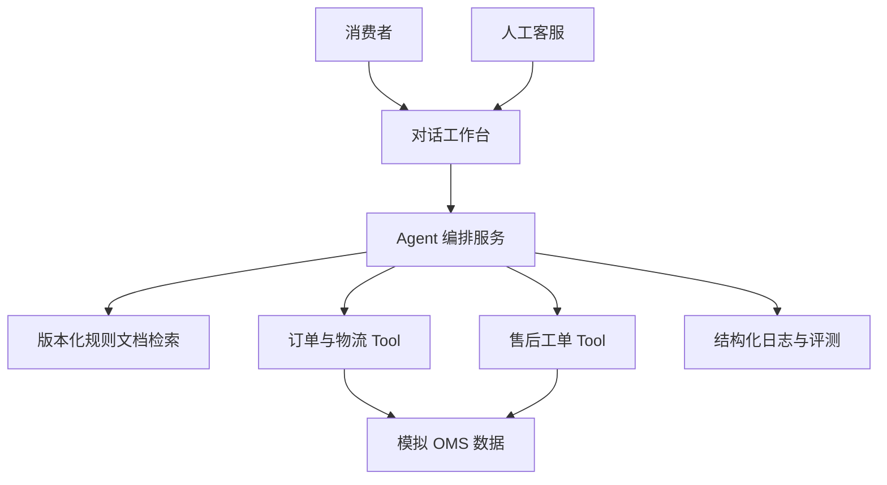

# 跨境电商售后 AI 客服交付 POC

> 文档状态：MVP 需求基线  
> 项目定位：作品集  
> 目标：演示从客户调研、POC、Agent/Skill 实施、系统集成、上线验收到持续优化的完整交付闭环。

## 1. 背景与价值

电商售后团队通常需要反复处理物流查询、退换货规则、订单异常与投诉升级。规则分散、订单状态依赖多个系统，人工客服需在多个页面间切换，且高风险问题不能只依赖模型自由回答。

本 POC 以“跨境电商售后咨询”为模拟客户场景，构建可部署、可评测、可交接的 AI 客服能力。它不模拟真实客户数据或真实生产收益；所有数据和验收结果均为作品集测试数据。

### 1.1 POC 成功标准

- 4 类核心业务场景可端到端演示：物流查询、退换货资格判断、规则问答、投诉/异常转人工；支付敏感问题作为独立高风险子意图处理。
- 支持中文多轮会话：在同一 `session_id` 下继承已绑定订单和上一轮意图，支持补充缺失参数和省略式追问。
- 对订单与工单操作仅通过受控 Tool 执行；模型不得编造订单或物流状态。
- 回答必须给出知识来源；资料不足、敏感争议或低置信度时转人工。
- 提供固定评测集、测试报告、badcase 记录和 Docker 化部署手册。

## 2. 用户与范围

| 角色 | 目标 | 核心操作 |
| --- | --- | --- |
| 消费者 | 快速获得可信售后答复 | 提问、提供订单号、接受转人工 |
| 人工客服 | 高效接管复杂问题 | 查看上下文摘要、处理工单、补充结果 |
| 客服主管 | 评估 AI 服务质量 | 查看转人工、失败调用与 badcase |
| 实施管理员（内部角色） | 交付客户可验收方案 | 配置知识、接口、规则、测试集与部署环境；不作为普通用户角色展示 |

### 2.1 MVP 范围

1. Web 对话工作台与人工接管视图。
2. 生产级 RAG 规则问答：文档分块与元数据过滤、向量召回、关键词召回、RRF 混合、Cross-Encoder/model 重排和生效版本校验，答案携带文档引用；本地测试可使用确定性 Provider，但生产模式必须注入真实模型服务。
3. 订单与物流查询 Tool（使用本地模拟 OMS/物流数据）。
4. 退换货资格判断 Tool（基于订单状态、签收时间、品类规则）。
5. 用户确认后提交退货申请 Tool，返回申请单号和待审核状态。
6. 创建售后工单 Tool，及人工接管上下文摘要。
7. 会话、工单和退货申请使用 SQLite 持久化；模型、检索、Tool 调用记录结构化事件。生产化需进一步接入租户隔离、迁移、备份、过期清理和可靠事件流。
8. 回归评测、badcase 管理与 Docker Compose 部署。

### 2.2 非范围

- 不对接真实云信、ERP、物流商、支付或客户生产系统。
- 不处理真实个人信息、真实订单或真实退款。
- 不训练、微调基础模型，不建设全渠道呼叫中心。
- 不宣称任何 POC 指标为客户生产结果。

## 3. 场景与业务规则

### 3.1 核心意图

| 意图 | 示例 | 系统行为 | 人工兜底条件 |
| --- | --- | --- | --- |
| 物流查询 | “订单 OD202608001 到哪里了？” | 调用物流查询 Tool 并解释状态 | 订单不存在、接口异常、连续追问未解决 |
| 退换货判断 | “签收 10 天可以退吗？” | 调用订单与规则 Tool，给出可操作步骤；符合条件后等待用户确认 | 争议退款、超规则例外、商品质量投诉 |
| 规则问答 | “海外仓发货多久能到？” | 检索规则并附来源 | 无可靠来源或置信度不足 |
| 投诉/异常 | “一直不退款，我要投诉” | 识别风险、生成摘要、创建工单并转人工 | 该意图默认转人工 |
| 支付敏感 | “帮我修改银行卡收款人” | 识别为 `payment_sensitive`，停止自动处置，创建支付敏感分类工单 | 该意图默认转人工，不调用订单或退款写操作 |

### 3.2 人工接管规则

满足任一条件即停止自动处置并建议转人工：

- 用户明确投诉、威胁、退款争议或涉及支付。
- 检索无有效证据，或工具返回错误/无数据。
- 同一会话连续两次未解决。
- Tool 判断该订单需要人工审批。

### 3.3 多轮会话规则

- 请求携带 `session_id` 时，会话可继承同一用户的已绑定订单和上一轮业务意图；不同用户不得访问同一会话上下文。
- 首轮缺少退货原因时，系统应提示补充；下一轮提供“尺码不合适”“商品质量问题”等中文原因后，继续执行退货资格判断。
- 物流查询完成后，用户可使用“那预计什么时候到？”等省略式中文追问，系统继续查询同一订单，不要求重复订单号。
- 同一会话连续两次未给出已验证事实或可执行下一步时，系统创建人工工单并记录“连续两次未解决”的转人工原因。
- 当前 MVP 支持会话上下文、工单和退货申请跨进程、跨重启恢复；事件指标仍为进程内存储，重启后不保留历史指标。

### 3.4 低置信度的可执行定义

系统满足任一条件时，标记为低置信度并执行“明确说明无法确认 → 转人工”，不得继续生成确定性结论：

- 意图分类最高分低于 `0.70`，或第一、第二候选意图分差小于 `0.10`。
- 规则问答检索未命中任何有效片段，或最高检索相似度低于项目配置阈值（MVP 初始值 `0.65`）。
- 生成答案未能关联至少 1 条已生效规则来源。
- 订单/物流/工单 Tool 返回无数据、校验失败、超时或服务错误。
- 用户在同一会话中连续两次追问后，系统仍未给出已验证的事实或可操作下一步。

所有阈值必须配置化，并以评测集测试结果调整；上线前不得仅以模型主观自评作为低置信度依据。

## 4. 交付方案

### 4.1 逻辑架构



### 4.2 Agent / Skill 设计

| Skill | 输入 | 输出 | 安全约束 |
| --- | --- | --- | --- |
| `query_order_logistics` | 订单号、已脱敏用户标识 | 订单与物流状态 | 仅 Tool 返回的数据可进入答案 |
| `check_return_eligibility` | 订单号、退货原因 | 是否符合规则、依据、下一步 | 不承诺实际退款；争议转人工 |
| `submit_return_application` | 订单号、退货原因、用户确认、幂等键 | 申请单号、待审核状态、后续步骤 | 仅用户明确确认后执行；不代表退款完成；校验订单归属 |
| `search_policy` | 用户问题 | 带引用的规则片段 | 无引用不得断言规则 |
| `create_service_ticket` | 会话摘要、分类、优先级 | 工单号、接管信息 | 仅模拟数据；记录调用审计 |
| `handoff_human` | 历史会话、原因 | 客服摘要与转接标记 | 不再继续自动处理高风险事项 |
| `payment_sensitive_route` | 用户消息、会话上下文 | 支付敏感分类、人工工单 | 不调用订单/退款写操作；必须记录转人工原因 |

### 4.3 关键数据对象

- `order`：订单号、用户匿名 ID、状态、支付时间、签收时间、商品品类。
- `shipment`：订单号、承运商、物流节点、异常标记、预计到达时间。
- `ticket`：工单号、订单号、分类、优先级、会话摘要、状态。
- `knowledge_document`：标题、版本、生效日期、适用区域、正文、来源链接。
- `conversation_event`：会话 ID、意图、检索引用、Tool 调用、响应耗时、转人工原因。

### 4.4 身份认证与数据权限

MVP 采用最小 RBAC，并使用模拟身份数据；真实生产环境应由客户统一身份系统提供认证与用户身份映射。

| 角色 | 可访问内容 | 关键限制 |
| --- | --- | --- |
| 消费者 | 本人会话、本人订单、本人创建的工单 | 每次订单查询均校验订单匿名用户 ID 与当前登录用户一致 |
| 人工客服 | 被分配工单及相应会话摘要 | 不可浏览无关消费者订单；敏感字段按脱敏规则展示 |
| 客服主管 | 团队质量指标、脱敏会话和工单统计 | 默认不展示完整订单与个人信息 |
| 实施管理员（内部角色） | 模拟环境配置、评测和系统日志 | 无消费者业务数据写入权限；不出现在普通用户角色选择器 |

前端工作台按角色裁剪可见面板：消费者可见演示导览和消费者对话；人工客服可见消费者对话和人工接管；客服主管可见人工接管、质量看板和知识规则；实施管理员可见演示导览、质量看板和知识规则。普通用户角色选择器仅展示消费者、人工客服和客服主管；实施管理员通过内部入口或受控身份进入。角色切换后只能进入当前角色允许的默认页面。

- 认证：MVP 使用本地模拟登录和短期会话令牌；接口层统一校验身份与角色。
- 授权：订单查询必须同时校验“订单号 + 当前用户归属”；客服动作必须校验工单分配范围。
- 审计：记录身份、角色、资源、操作、结果与事件 ID；不得记录令牌、完整地址或联系方式。
- 数据最小化：Tool 返回模型所需的最少字段，例如物流状态而非完整收货信息。

## 5. 功能需求

### FR-01 对话与会话管理

- 用户可创建会话、输入问题、查看回答和引用来源。
- 用户可在同一 `session_id` 内进行中文连续追问；系统继承订单和上一轮意图，并支持补充退货原因等缺失参数。
- 系统显示当前处理状态：检索、调用工具、已转人工。
- 每轮会话记录可追溯的事件 ID。
- 会话上下文必须按用户隔离，并从 SQLite 恢复；事件指标不作为业务状态事实来源。

### FR-02 知识问答

- 支持售后规则、物流时效、退换货流程等文档入库与检索。
- 输出应包含引用文档标题及片段；无法确认时明确说明并转人工。
- 文档必须有版本与生效日期，便于交付更新。

### FR-03 受控工具调用

- 仅允许 Agent 调用白名单 Tool；每个 Tool 有明确 JSON 输入输出模型。
- 对订单号格式、必填参数、错误码进行校验。
- Tool 调用超时、失败或无数据时不可生成虚构结论。

#### Tool 契约、异常与降级

所有 Tool 使用 JSON Schema/Pydantic 模型定义输入和输出，并返回统一字段：`success`、`data`、`error_code`、`message`、`trace_id`。

| Tool | 契约要点 | 失败处理 | 幂等要求 |
| --- | --- | --- | --- |
| `query_order_logistics` | 输入：订单号；输出：订单状态、物流节点、异常标记 | 400 参数错误、404 无订单、504 超时；均不生成物流结论并转人工/引导核对 | 只读，无需幂等键 |
| `check_return_eligibility` | 输入：订单号、退货原因；输出：资格、规则版本、依据 | 订单状态异常或规则缺失时转人工 | 只读，无需幂等键 |
| `submit_return_application` | 输入：订单号、退货原因、`idempotency_key`；输出：申请单号、状态、后续步骤 | 未授权、订单不存在或写入失败时不声称已提交 | 必须幂等；同一会话同一确认事件不可重复创建 |
| `search_policy` | 输入：问题、区域；输出：已生效文档片段及版本 | 无有效来源时拒答并转人工 | 只读，无需幂等键 |

规则问答前端必须展示受控 Tool 返回的规则正文/答案、来源标题和版本，不能只展示“查询成功”或“已附引用”等过程性文案。
| `create_service_ticket` | 输入：会话摘要、分类、优先级、订单号 | 校验失败或创建失败时展示人工渠道，不声称已建单 | 必须传入 `idempotency_key`，同一会话同一事件不可重复建单 |

- 超时：MVP Tool 默认超时 3 秒；超时后不自动重试写操作。只读查询最多重试 1 次，并记录重试次数。
- 降级：Tool 异常时输出受控兜底文案与人工接管，不以模型猜测替代系统事实。
- 写操作确认：资格判断是只读操作；只有用户明确点击/确认提交后，才允许调用 `submit_return_application`。申请状态为“待审核”不等于退款完成。
- 业务操作卡片必须跟随产生该操作的会话消息展示，作为消息流中的上下文操作；不得将退货申请、投诉建单、人工接管等业务主操作长期固定在输入框区域。
- 人工审核队列：`待审核` 退货申请必须进入人工客服可见的退货审核队列，并展示申请单号、订单号、退货原因和当前状态；不得只返回给消费者而丢失审核入口。
- 审核状态流转：人工客服或主管可将 `待审核` 更新为 `审核通过` 或 `审核不通过`；审核不通过必须填写原因，已处理申请不可重复审核。
- 人工接管处理：人工客服打开工单后必须能查看会话摘要和已执行动作，填写客服回复，并将工单更新为“已解决”“待补充信息”或“已升级主管”；已处理工单不可重复更新。
- 客服操作体验：处理工单必须进入页面内的工单详情/会话工作区完成，不使用浏览器 `alert`/`prompt` 作为正式回复入口。
- 人工消息回传：客服回复保存后，消费者会话必须能读取并展示人工客服消息、处理状态和回复内容，不能只显示“已转人工”。
- 消费者状态同步：消费者页面必须通过申请状态查询读取服务端最新状态；客服审核后，不得继续展示提交时的 `待审核` 快照。
- 审计：每次调用记录 `trace_id`、请求校验结果、耗时、错误码、重试次数和调用方角色。

### FR-04 人工接管与工单

- 转人工时生成摘要：用户诉求、订单信息、已执行动作、引用依据、转接原因。
- 支持创建模拟售后工单并返回工单号。
- 退货资格通过后，消费者可明确确认提交模拟退货申请，查看申请单号、待审核状态和后续寄回步骤。
- 消费者对话在已绑定订单上下文时，所有需要订单事实的咨询默认使用该订单，不要求消费者重复输入订单号；只有没有绑定订单时才提示补充订单号。
- 物流查询回答必须直接呈现受控物流 Tool 返回的订单状态、最新节点、地点和预计到达时间；不得只返回“已根据 Tool 回答”等无业务信息的占位文案。
- 客服工作台可查看待处理工单和会话摘要。
- 人工接管队列必须支持服务端分页和条件搜索，至少支持类型、状态、工单/申请单号、订单号和用户诉求关键词；默认每页不超过 20 条。

### FR-05 评测与质量闭环

- 建立不少于 50 条 MVP 测试集，覆盖四类核心意图与异常场景。
- 固定评测集当前为 58 条，覆盖中文口语、错别字、省略式追问、连续多轮会话、支付敏感独立路由、跨用户越权、重复写入、业务边界、Tool 异常、知识无依据和规则版本。
- 每条测试用例包含：输入或多轮输入、期望意图、是否调用 Tool、预期事实/引用、是否转人工、工单分类、规则版本和状态码。
- 记录失败样例的根因、修复动作、回归结果与版本。

#### 测试集分层

MVP 测试集不少于 50 条，按以下分层构建；同一用例可覆盖多个验证点，但统计时以主类别归档。

| 类别 | 最少数量 | 验证重点 |
| --- | ---: | --- |
| 正常主流程 | 20 | 四类核心意图、正确事实、正确 Tool 调用与引用 |
| 业务边界 | 10 | 超时退货、不同区域规则、订单状态不一致、缺失参数 |
| Tool 异常 | 8 | 400/404/504、重试、受控降级、不编造事实 |
| 风险与转人工 | 8 | 投诉、退款争议、支付敏感独立分类、连续未解决、低置信度 |
| 知识冲突/无依据 | 4 | 文档版本冲突、过期规则、无来源问题、拒答行为 |

每条用例必须包含：`case_id`、输入或 `turns`、前置数据、预期意图、允许/禁止 Tool、预期事实或引用、预期转人工、`expected_ticket_category`、`expected_rule_version`、版本号和实际结果。英文表达暂不纳入本轮固定集。

## 6. 非功能与安全要求

- 使用模拟、匿名化数据；仓库不提交密钥、真实订单或真实个人信息。
- 所有 API 密钥通过环境变量注入；提供 `.env.example`。
- 记录模型耗时、检索命中、Tool 耗时、错误码和转人工原因；日志避免写入原始敏感内容。
- Docker Compose 可一键启动；README 给出最低环境要求、配置和验证步骤。

### 6.1 可观测性与告警

MVP 不要求接入外部告警平台，但必须提供可查询的结构化指标、阈值定义和处置 Runbook。

| 指标 | 统计口径 | 告警阈值（MVP） | 首要处置 |
| --- | --- | --- | --- |
| Tool 错误率 | 5 分钟内失败调用 / 总调用 | > 5% | 检查错误码、依赖服务与降级是否生效 |
| 无引用规则回答率 | 无有效引用的规则回答 / 规则回答总数 | > 2% | 检查检索、Prompt 与文档生效状态 |
| 高风险未转人工率 | 应转人工却未转接的样本 / 应转人工样本 | > 1% | 暂停自动处置对应意图，复核规则与测试集 |
| P95 端到端时延 | 最近 5 分钟响应时延 P95 | > 10 秒 | 区分模型、检索、Tool 耗时并限流/降级 |
| 重复建单次数 | 相同幂等键的重复成功建单 | > 0 | 检查幂等校验，停止写操作重试 |

- 每个请求贯穿 `trace_id`，可关联会话、检索、模型与 Tool 事件。
- 质量看板至少展示：会话量、意图分布、转人工率、Tool 成功率、错误码分布、无引用率、时延与 badcase 数。
- 告警触发后的处置过程和结论记录到 badcase/事件记录中。

### 6.2 发布与回滚

以下对象必须独立版本化：知识文档集合、Prompt、Agent/工作流配置、Tool 配置、评测集和应用镜像。

- 发布前：在固定评测集上执行回归；核心指标不得低于当前已验收基线，且高风险转人工覆盖率不得下降。
- 灰度：MVP 以“演示环境的指定会话/测试集”为灰度范围，记录版本、时间、操作者和结果。
- 回滚：出现高风险未转人工、无引用回答、重复建单或核心指标回退时，切换到最近一个已验收版本；写操作可通过配置开关立即禁用。
- 变更记录：每次发布记录变更内容、关联评测报告、风险、批准人（MVP 可由项目维护者承担）和回滚结果。

## 7. 验收计划

### 7.1 验收指标

以下均为作品集 POC 目标，完成后以真实测试结果替换：

| 指标 | 定义 | MVP 目标 |
| --- | --- | --- |
| 核心场景通过率 | 评测集中符合预期行为的比例 | ≥ 85% |
| 工具调用成功率 | 合法请求成功返回受控结果的比例 | ≥ 95% |
| 引用有效率 | 规则问答含正确来源的比例 | ≥ 90% |
| 高风险转人工覆盖率 | 应转人工样本被正确转接的比例 | ≥ 95% |
| P95 响应时延 | 本地演示环境端到端时延 | ≤ 10 秒 |

### 7.2 演示脚本

1. 用户询问物流，Agent 调用 Tool 并返回可追溯状态。
2. 用户追问“那预计什么时候到？”，系统继承订单上下文并返回预计到达时间。
3. 用户询问退换货，Agent 查询订单和规则；用户下一轮补充退货原因后继续判断。
4. 用户确认提交退货申请，系统创建申请单并展示待审核状态与后续步骤。
5. 用户发起退款投诉或支付敏感请求，系统停止自动处置、按风险类别创建工单并生成客服摘要。
6. 主管查看会话链路、工具调用和一个 badcase 的修复前后结果。

## 8. 技术方案与目录建议

- 前端：Next.js / React，提供对话页、人工接管页、质量看板。
- 后端：Python + FastAPI，提供 Agent、Tool、评测与管理 API。
- 编排：LangGraph；模型通过 OpenAI-compatible API 接入。
- 数据：MVP 使用 SQLite 或 DuckDB；知识向量存储可使用本地轻量实现。
- 交付：Docker Compose；可选 Kubernetes manifests 作为扩展，不作为 MVP 阻塞项。

建议目录：

```text
apps/web/                 # 对话与客服工作台
apps/api/                 # FastAPI、Agent 与 Tool
data/mock/                # 匿名订单、物流、规则样例
knowledge/                # 可追溯规则文档
evals/                    # 测试集、评测脚本、badcase
docs/                     # 方案、接口、验收、部署、排障
deploy/docker-compose.yml
```

## 9. 文档交付清单

- `README.md`：价值、效果图、架构、快速启动、演示路径与限制。
- `docs/customer-discovery.md`：客户调研、范围、价值假设与验收标准。
- `docs/solution-design.md`：架构、数据流、权限与人机协同设计。
- `docs/api-contracts.md`：Tool/API 契约、错误码、重试与幂等策略。
- `docs/poc-acceptance-report.md`：测试结果、指标、已知风险与结论。
- `docs/deployment-runbook.md`：部署、配置、日志、故障排查与回滚。

## 10. 分阶段计划

| 阶段 | 交付 | 完成定义 |
| --- | --- | --- |
| P0 场景建模 | 调研、规则、模拟数据与验收用例 | 明确范围与人机边界 |
| P1 核心闭环 | RAG、订单/工单 Tool、转人工 | 四类核心意图可演示 |
| P2 质量闭环 | 评测集、日志、badcase | 可输出量化 POC 报告 |
| P3 交付包装 | Docker、Runbook、演示视频 | 新人可按文档复现演示 |
