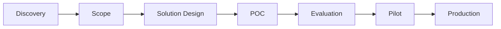

# FDE Delivery Playbook

> AI Agent 交付方法论：从客户调研到生产运维的完整闭环。
>
> 本文档展示这是一个"AI 交付项目"，而不是纯代码 Demo。

---

## 1. Discovery（客户调研）

| 维度 | 说明 |
| --- | --- |
| **输入** | 客户问题、系统现状、业务指标、数据样本、可用 API |
| **动作** | 梳理售后咨询类型分布、人工处理时长、转人工率、高风险问题占比；确认 OMS/物流/工单/知识库接口可用性 |
| **输出** | Use Case 清单、Baseline 指标、Risk Boundary 定义 |
| **验收标准** | 客户确认高频场景和风险边界；基线数据可量化；系统接口文档可获取 |

参考：[`docs/customer-discovery.md`](customer-discovery.md)

---

## 2. Scope（范围定义）

| 维度 | 说明 |
| --- | --- |
| **输入** | Discovery 输出的 Use Case 和风险边界 |
| **动作** | 划分自动化范围和不自动化范围；确定 MVP 场景优先级 |
| **输出** | MVP Scope、非范围声明、风险等级矩阵 |
| **验收标准** | 自动化范围有明确 Tool 支持；不自动化范围有明确转人工路径 |

本项目 MVP 范围：

- **自动化**：物流查询、退货资格判断、规则问答（RAG）、工单创建与人工接管
- **不自动化**：支付敏感操作、退款争议、投诉升级、无依据问题

参考：[`SPEC.md`](../SPEC.md) §2.1 MVP 范围

---

## 3. Solution Design（方案设计）

| 维度 | 说明 |
| --- | --- |
| **输入** | Scope、系统接口、风险等级 |
| **动作** | 设计 Agent → Skill → Tool 三层架构；定义意图目录、Skill Manifest、Tool 契约、状态流转和集成层 |
| **输出** | 架构设计文档、API 契约、数据模型、ADR |
| **验收标准** | 架构图覆盖 Logical/Deployment/Trust Boundary；关键决策有 ADR；API 契约可评审 |

核心设计：

- Agent（LangGraph）只编排，不拥有业务事实
- Skill 封装场景流程、权限、确认和降级
- Tool 执行原子操作，校验归属和幂等
- Integration Layer 控制超时、重试、熔断和错误映射

参考：[`docs/solution-design.md`](solution-design.md)、[`docs/api-contracts.md`](api-contracts.md)、[`docs/adr/`](adr/)

---

## 4. POC（概念验证）

| 维度 | 说明 |
| --- | --- |
| **输入** | Solution Design |
| **动作** | 实现 Mock 数据、受控 Tool、场景 Skill、RAG 和前端工作台；建立 Docker Compose 部署 |
| **输出** | 可演示 POC、Mock 数据集、部署手册 |
| **验收标准** | 四类核心场景可端到端演示；高风险问题正确转人工；Docker 可一键启动 |

POC 边界：

- 所有订单、物流、规则和工单均为匿名模拟数据
- Mock 组件明确标记为 Mock
- 本地 TraceStore 使用 SQLite，不接入外部观测后端

参考：[`docs/deployment-runbook.md`](deployment-runbook.md)

---

## 5. Evaluation（评测）

| 维度 | 说明 |
| --- | --- |
| **输入** | POC 实现 |
| **动作** | 建立分层评测集（正常/边界/异常/风险/无依据）；运行意图、记忆、Skill 和 RAG 专项评测；记录 badcase |
| **输出** | 评测报告、Badcase 记录、发布门禁结果 |
| **验收标准** | 核心通过率 ≥ 85%；高风险召回 100%；越权/未确认/重复写 = 0；RAG 回归 ≥ 90% |

评测分层：

| 评测 | 用例数 | 门禁 |
| --- | ---: | --- |
| 核心固定集 | 58 | ≥ 85% |
| 意图专项 | 60 | ≥ 95%，高风险 100% |
| 短期状态 | 12 | 100%，泄漏 0% |
| Skill 选择 | 16 | ≥ 95% |
| Skill 执行 | 13 | ≥ 95% |
| RAG 回归 | 40 | ≥ 90% |
| RAG 挑战 | 30 | 报告指标，非门禁 |

参考：[`docs/evaluation-and-badcase.md`](evaluation-and-badcase.md)、[`docs/poc-acceptance-report.md`](poc-acceptance-report.md)

---

## 6. Pilot（试点）

| 维度 | 说明 |
| --- | --- |
| **输入** | 评测通过的 POC |
| **动作** | Shadow 模式运行；限定流量灰度；人工接管边界验证 |
| **输出** | Pilot 报告、真实流量指标、问题列表 |
| **验收标准** | 无高风险漏接；自动解决率有基线对比；人工接管路径有效 |

> 本项目当前处于 POC 阶段，尚未进入 Pilot。Pilot 需要客户生产环境配合。

---

## 7. Production（生产）

| 维度 | 说明 |
| --- | --- |
| **输入** | Pilot 通过的系统 |
| **动作** | 接入客户认证、生产数据库、真实业务系统；配置监控、告警和回滚 |
| **输出** | 生产部署、监控看板、回滚预案 |
| **验收标准** | SLA 达标；告警阈值有效；回滚可在 5 分钟内完成 |

生产化前必须完成：

1. 接入客户认证、授权和租户级数据隔离
2. 将 SQLite 升级为生产数据库 + 迁移 + 备份
3. 对 OMS/物流/工单/知识库接入设置超时、重试、熔断、审计和告警
4. 增加客服分配、实时指标、灰度发布和写操作紧急禁用
5. 为 RAG 接入生产 embedding、向量索引和 reranker
6. 将静态前端升级为可维护前端工程 + E2E 测试
7. 为 Skill Manifest 增加审批、兼容性校验和灰度回滚

---

## 交付阶段总结



每一阶段都遵循：

```text
Input → Action → Output → Acceptance Criteria
```
