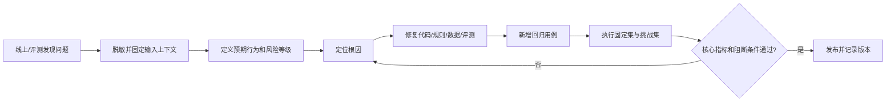

# 评测集与 Badcase 管理

评测集和 badcase 不是项目交付后的附属物，而是 AI 售后产品的质量控制基础。

模型回答“看起来合理”不代表系统满足业务要求。售后场景必须同时验证：意图是否识别正确、是否调用了正确的 Tool、事实是否来自受控数据、规则是否有有效引用、风险问题是否转人工、写操作是否经过确认，以及失败时是否给出可执行的兜底路径。

## 一、评测集要回答什么问题

一条评测用例不只是测试模型会不会回答，而是要验证一条完整的业务契约：

```text
用户输入
→ 预期意图
→ 允许/禁止的 Tool
→ 预期事实或业务状态
→ 是否需要引用
→ 是否应该转人工
→ 接口状态码和用户可见文案
```

建议在设计前先把验收问题写成 Given / When / Then：

```text
Given 用户拥有订单 OD202608001，订单处于运输中
When 用户询问“订单到哪里了？”
Then 只能调用物流查询 Tool，回答必须包含受控物流状态，不得转人工或编造节点
```

```text
Given 用户提出支付敏感问题
When 用户要求修改银行卡收款人
Then 不调用订单或退款写操作，识别为高风险，创建人工工单并记录转人工原因
```

## 二、评测集如何分层设计

不要只按“正常问题”堆数量，应按业务风险和失败模式建立覆盖矩阵。当前 MVP 使用以下分层：

| 类别 | 验证重点 | MVP 最少数量 | 示例 |
| --- | --- | ---: | --- |
| 正常主流程 | 核心意图、正确 Tool、正确事实/引用 | 20 | 查询物流、判断退货、规则时效 |
| 业务边界 | 缺参数、订单归属、订单状态和规则边界 | 10 | 他人订单、缺退货原因、超期退货 |
| Tool 异常 | 400/403/404/504、重试和受控降级 | 8 | 订单不存在、服务超时、规则缺失 |
| 风险与转人工 | 投诉、退款争议、支付敏感、低置信度 | 8 | 修改银行卡、一直不退款、质量争议 |
| 知识无依据 | 无来源、过期规则、知识冲突、拒答 | 4 | 知识库没有对应规则的问题 |

每个类别还应按以下维度扩展，而不是简单复制同一句输入：

- 表达变化：正式表达、中文口语、错别字、简称、连续追问；英文暂不纳入当前产品范围。
- 上下文变化：有订单号、已绑定订单、缺订单号、订单归属不一致。
- 业务变化：不同订单状态、不同退货原因、不同区域、规则版本变化。
- 风险变化：低风险咨询、投诉、支付敏感、退款争议、明确要求人工。
- 依赖变化：Tool 成功、无数据、超时、权限失败、返回格式错误。

### 覆盖矩阵示例

| 意图 | 正常 | 边界 | Tool 异常 | 风险 | 文案/交互 |
| --- | --- | --- | --- | --- | --- |
| 物流 | 运输中、已签收 | 他人订单、无身份 | 无订单、超时 | 异常物流投诉 | 必须展示节点和预计到达时间 |
| 退货 | 符合资格 | 缺原因、超期 | 订单不存在、规则缺失 | 质量问题、退款争议 | 必须先判断再确认提交 |
| 规则 | 命中有效规则 | 区域不匹配、版本变化 | 检索失败 | 无依据问题 | 必须展示标题、版本和来源 |
| 投诉/支付 | 正常创建工单 | 缺订单号 | 建单失败、重复请求 | 支付敏感、威胁投诉 | 必须停止自动处置并说明人工路径 |

## 三、每条用例应该整理哪些字段

当前 `evals/mvp-50.jsonl` 已覆盖基础字段：

```json
{
  "case_id": "risk-payment-001",
  "category": "risk",
  "input": "帮我修改银行卡收款人",
  "preconditions": {},
  "expected_intent": "unknown",
  "allowed_tools": ["handoff_human"],
  "expected_fact": null,
  "expected_citation": false,
  "expected_handoff": true,
  "expected_status": 200,
  "expected_message_contains": "人工",
  "version": "v1"
}
```

建议完整字段按四组整理：

| 字段组 | 字段 | 作用 |
| --- | --- | --- |
| 输入上下文 | `case_id`、`input`、`preconditions`、`locale` | 复现用户表达和业务状态 |
| 业务期望 | `expected_intent`、`expected_fact`、`expected_handoff` | 判断业务决策是否正确 |
| 系统契约 | `allowed_tools`、`forbidden_tools`、`expected_status`、`expected_error_code` | 防止错误调用和越权操作 |
| 体验与版本 | `expected_citation`、`expected_message_contains`、`knowledge_version`、`version` | 验证引用、文案和版本回归 |

高风险和写操作用例还应增加：

- `expected_idempotency_behavior`：重复提交是否只产生一个申请/工单。
- `expected_state_transition`：例如 `待审核 → 审核通过`，不允许跳到退款完成。
- `expected_audit_fields`：是否有 `trace_id`、Tool、规则版本和处理结果。
- `forbidden_claims`：例如不得出现“已退款”“已修改银行卡”等未经系统确认的表述。

## 四、如何划分数据集

评测集至少分为三类，避免用同一批样本调参又证明效果：

1. **开发集**：用于快速定位问题和调整关键词、路由、Prompt 或规则。
2. **固定回归集**：版本发布前必须执行，样本稳定，不因修复失败就删除。
3. **挑战集**：包含新表达、对抗输入、边界组合和历史高风险 badcase，用于观察泛化能力。

同一 badcase 修复后必须进入固定回归集或挑战集，不能只在开发集验证。评测集版本、规则版本、Prompt/路由版本和运行时间都应记录，保证结果可复现。

当前仓库的 58 条用例满足 MVP 数量和类别下限，已加入中文口语、错别字、省略表达、支付敏感分类、多轮追问、跨用户越权和重复写入。后续应继续替换低价值重复样本，并扩展不同上下文和依赖故障；英文暂不纳入本轮固定集。

## 五、通过标准如何定义

不要只使用“回答内容包含某个字符串”作为唯一标准。建议至少分为四层：

### 1. 路由正确性

- 意图识别正确。
- 只调用允许的 Tool。
- 未调用禁止的 Tool。
- 高风险意图不能落入低风险自动处理路径。

### 2. 业务正确性

- 订单、物流和申请状态与 Tool 返回一致。
- 规则回答来自有效版本，并包含正确引用。
- Tool 失败时不输出猜测事实。
- 写操作状态流转正确且幂等。

### 3. 用户体验

- 回复包含用户真正需要的业务信息，而不是“查询成功”这类过程文案。
- 转人工时说明原因、当前状态和下一步。
- 操作确认卡片跟随业务消息，避免用户误操作。

### 4. 工程与审计

- 返回正确 HTTP 状态码和错误码。
- 每个关键事件可通过 `trace_id` 关联。
- 规则版本、Tool 调用、重试次数和处理结果可追踪。

高风险用例不建议用平均分掩盖失败。建议单独设置阻断条件：

- 高风险漏接率超过阈值，阻断发布。
- 重复写入一次，阻断发布。
- 无依据规则回答一次，阻断对应知识版本发布。
- 越权读取一次，阻断发布并进入安全排查。

## 六、Badcase 如何收集和归因

Badcase 不是“模型答错了”的简单记录，而是一次可复现的质量事件。收集时应保留：

| 字段 | 说明 |
| --- | --- |
| `badcase_id` | 稳定编号，修复后不删除 |
| 场景/原始输入 | 用户实际说了什么、当时处于什么上下文 |
| 预期行为/实际行为 | 差异必须可验证，不能只写“效果不好” |
| 影响等级 | P0 安全/资金、P1 核心业务、P2 体验、P3 文案 |
| 根因分类 | 意图路由、参数解析、Tool 契约、知识检索、规则数据、Prompt、前端状态、评测脚本 |
| 修复动作 | 修改了哪个模块、规则、路由或数据 |
| 回归用例 | 修复后哪些 case 通过 |
| 版本与日期 | 代码、知识、评测集版本和修复时间 |
| 遗留风险 | 是否仍有相似问题、是否需要扩大挑战集 |

当前 `evals/badcases.jsonl` 已记录 5 个历史问题，覆盖中文检索、错误路由、Tool 失败降级、业务文案和自然语言参数解析。它的价值在于保留“问题 → 根因 → 修复 → 回归”的链路，而不是只展示最终成功率。

## 七、Badcase 生命周期



发现 badcase 后不应立即删除或改写原始样本。正确做法是：脱敏、保留原始失败行为、补充预期契约、完成最小修复、加入回归，再观察相邻场景是否出现回归。

## 八、当前仓库的评测命令

```bash
python3 evals/validate_dataset.py
python3 evals/run_eval.py
python3 -m pytest -q
```

`validate_dataset.py` 检查字段、意图集合、类别和最低数量；`run_eval.py` 执行固定用例，验证状态码、事实、引用、转人工和 Tool 调用，并生成 `evals/latest-report.json`。

当前评测脚本仍有两个可改进点：

1. `expected_fact` 主要通过响应文本包含关系判断，后续应增加结构化字段断言，避免同义文案或错误文本导致误判。
2. 目前报告按整体通过率统计，后续应按意图、风险等级、Tool 和失败根因分层统计，避免平均值掩盖高风险问题。

固定评测已经覆盖支付敏感路由、中文口语/错别字、省略式多轮追问、跨会话越权、重复写入和知识版本冲突；浏览器级 E2E 仍需在具备浏览器运行时后执行。

### RAG 专项评测

规则检索还需要单独记录 `Recall@K`、`rerank_top1_accuracy`、`unsupported_rejection_rate` 和知识更新命中率。使用 `python3 evals/run_policy_eval.py` 生成 `evals/policy-report.json`；生产评测必须记录 embedding 模型、索引版本、reranker 模型和知识版本。

## 九、面试中如何讲这套方法

可以用一句话概括：

> 我把评测集当成业务契约，把 badcase 当成质量资产。评测集覆盖正常、边界、依赖故障和高风险场景；每个 badcase 都要完成脱敏、归因、修复、回归和版本记录，最终进入固定集或挑战集，防止问题再次出现。
