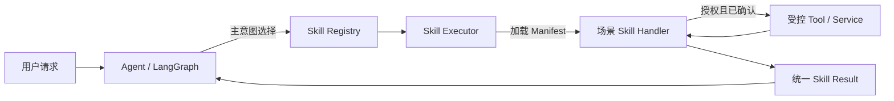
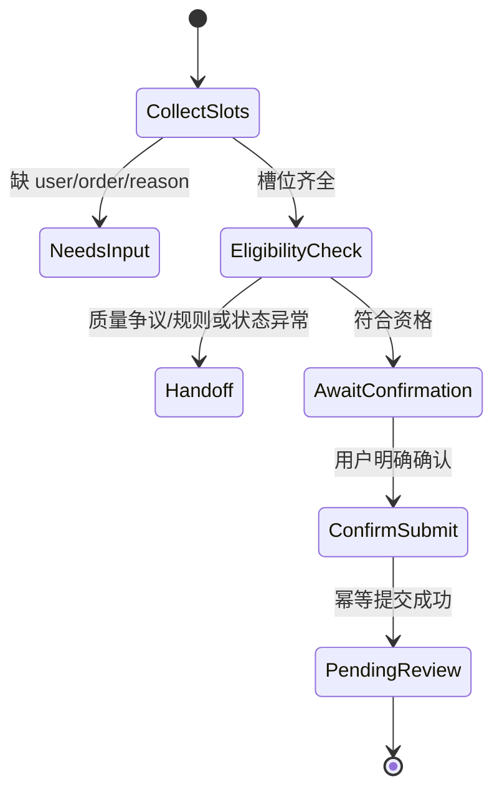
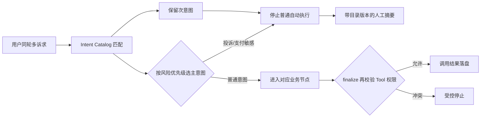
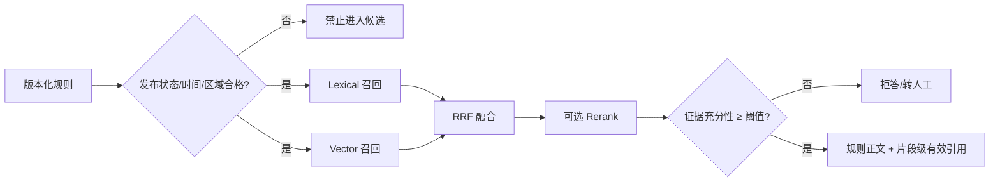
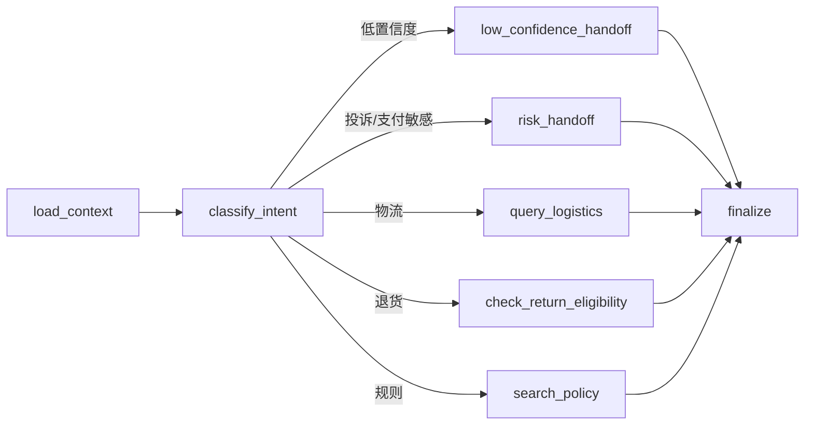
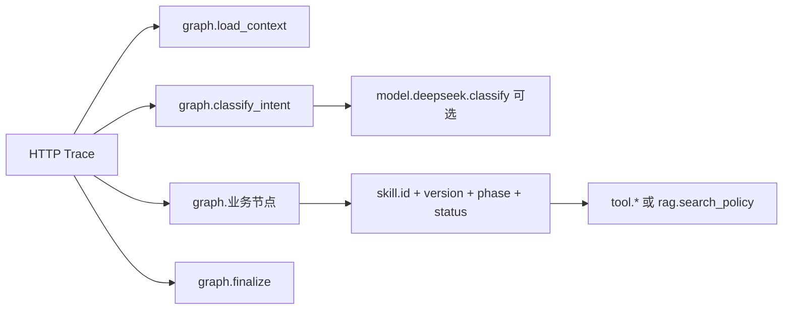
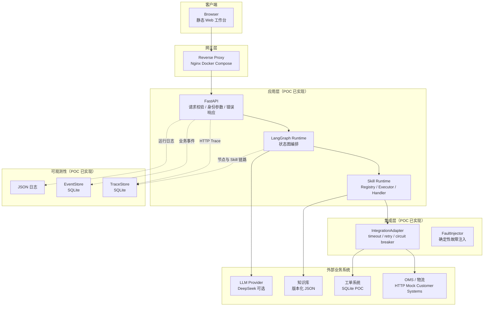
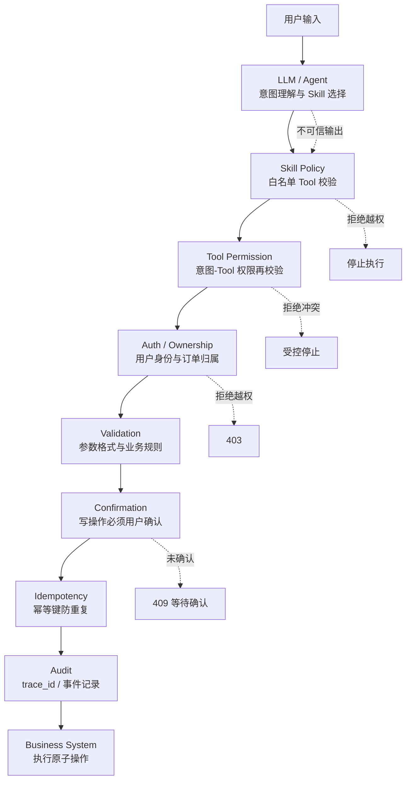
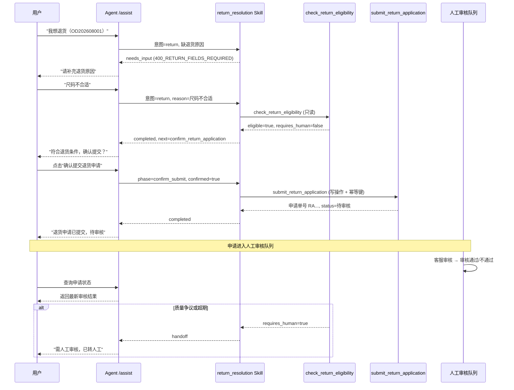

# 解决方案设计

`/assist` 是 MVP 编排入口，由 LangGraph 显式状态图执行 `load_context → classify_intent → 选择场景 Skill → finalize`。意图分类先使用版本化 Intent Catalog 中的显式安全信号，目录未命中的长尾表达才交给可选 DeepSeek，模型输出仍必须属于目录。图节点不再直接拥有业务 Tool，而是调用统一 Skill Executor；Executor 校验意图边界、Tool 权限和写操作确认，Handler 完成场景流程，Service/Tool 仍是业务事实与写操作的所有者。

## Agent、Skill 与 Tool 的责任边界



| 层级 | 拥有的决策 | 不拥有的权力 |
| --- | --- | --- |
| Agent | 上下文加载、主意图与 Skill 选择、节点顺序 | 不直接决定业务事实或绕过 Skill 权限 |
| Skill | 槽位、执行阶段、允许 Tool、确认、降级和标准输出 | 不绕过 Tool 自身认证、幂等与数据校验 |
| Tool/Service | 原子查询或写操作、业务事实、资源权限 | 不负责理解完整用户场景 |

每个 JSON Manifest 是场景能力的治理契约，代码 Handler 是实现；Registry 确保一个主意图只有一个 Skill，Executor 是统一策略执行点。将 Manifest 和 Handler 分开，是为了让产品/运营边界可以被审阅和版本化，同时避免让配置文件承载复杂业务代码。

### 退货 Skill 的两阶段流程

`return_resolution` 同时封装只读资格判断和确认后写入，两个 Tool 不被当成两个孤立 Skill：



Tool 的 `success` 表示原子调用按契约返回，不等于场景已自动闭环；例如资格查询成功但 `requires_human=true` 时，Skill 状态为 `handoff`。这一层状态区分用于正确计算自动解决率和人工压力。

## Customer System Integration Boundary

当前 POC 用 HTTP Mock Customer Systems 模拟客户 OMS 和 Logistics；Agent 侧不直接读取 `data/mock/customer/*.json`。实际边界是：

```text
Customer OMS / Logistics API
  → CustomerSystemClient
  → IntegrationAdapter
  → apps/api/support/mappers.py
  → canonical order / logistics record
  → query_order_logistics Tool
  → logistics_inquiry Skill
```

客户字段和内部字段的映射是显式、可测试的契约：

| Canonical field | Customer field | Current mapping |
| --- | --- | --- |
| `order_id` | `order_no` | direct |
| `anonymous_user_id` | `customer_ref` | direct |
| `order_status` | `fulfillment_status` | `DELIVERED` → `已签收` |
| `category` | `category_code` | `STANDARD_GOODS` → `standard_goods` |
| `logistics.carrier` | `carrier_code` | `DEMO_EXPRESS` → `Demo Express` |
| `logistics.latest_event` | `tracking_events[-1]` | event fields normalized into one event |
| `logistics.exception` | `has_exception` | boolean normalization |
| `logistics.estimated_arrival` | `eta` | direct |

这个边界的交付价值是把客户 API 的字段命名、枚举和错误契约限制在 Client / Mapper 中；Agent 和 Skill 只消费 canonical domain model。当前 Ticket 仍是 SQLite POC Service，不虚构已接入外部 SCRM。真实客户接入前需要补充认证、限流、字段版本、契约测试和数据脱敏确认。

## Automation Boundary

自动化决策与架构边界一致：物流查询是只读自动化，退货资格是带规则证据的自动判断，退货提交必须确认后写入；投诉、退款争议、支付敏感和外部依赖故障进入人工。这个决策矩阵来自 [`customer-discovery.md`](customer-discovery.md)，不是由模型临时决定。

## 意图资产与安全路由

`config/intent-catalog.json` 是意图边界的单一配置来源。每个条目包含业务描述、owner、风险等级、优先级、必需槽位、允许/禁止 Tool、风险标签、规则信号、正例和 hard negative；服务启动时校验必需意图及其路由 Tool，配置不完整即 fail fast。分类结果记录 `catalog_version`、主意图、次意图和风险标签，便于回放一次决定依据的业务版本。



这里选择“确定性高风险优先 + 受目录约束的模型回退”，而不是让模型拥有最终路由权。原因是投诉误分为物流与物流误分为投诉的业务成本不对称：前者可能漏掉风险，后者主要降低自动化率。没有主/次意图时，“包裹没到，我要投诉”要么漏掉投诉，要么在转人工摘要中丢掉物流诉求；没有运行时 Tool 校验时，一次分类错误还可能直接扩大操作权限。具体决策见 `docs/adr/0003-versioned-intent-catalog-and-risk-priority.md`。

## 短期业务状态

`ConversationStore` 不保存聊天全文作为记忆，只保存结构化槽位与 Tool 已验证事实。每个状态项均包含值、来源、置信度、会话/订单作用域、记录时间和过期时间。权威顺序是“本轮用户显式输入/纠正 > 未过期会话继承”；Tool 事实标记为 `tool_verified`，但实时回答仍重新查询业务 Tool。

| 状态 | 默认 TTL | 作用域 | 设计原因 |
| --- | ---: | --- | --- |
| 订单绑定 | 24 小时 | 会话 | 支持连续咨询，用户纠正时替换 |
| 上一意图 | 30 分钟 | 会话 | 支持省略式追问，避免隔很久仍延续旧任务 |
| 退货原因 | 60 分钟 | 订单 | 只对当前订单有效，切换订单立即清除 |
| 物流事实 | 5 分钟 | 订单 | 状态变化快，不允许长期复用 |
| 退货判断事实 | 15 分钟 | 订单 | 短时审计/上下文可用，实时结论仍重查 |

各 TTL 可由环境变量配置。只使用统一会话 TTL 会让变化很快的物流事实存活过久；保存全文/摘要虽然更自然，却无法解释来源、时效和订单归属；完全无状态又会让用户重复输入。因此当前方案在连续体验和业务正确性之间选择了最小结构化状态，详见 `docs/adr/0004-structured-short-term-business-state.md`。

## RAG 正确性边界



版本生命周期、检索相关性和证据充分性是三种不同判断。旧版本即使措辞更贴近问题也不得进入候选；主题相关的规则即使排在 Top1，如果不能回答“发票、赔付、保险”等细节也必须拒答。POC 的证据门禁使用知识负责人维护的可回答范围和确定性匹配，生产可替换为经校准的 NLI/模型验证器，但不得删除这一契约。

LangGraph 状态只承载本轮请求所需的输入、路由判断、Tool 结果和待持久化更新。跨请求会话仍以 SQLite `ConversationStore` 为事实来源，工单和退货申请仍由各自 Service 持久化；当前不启用 LangGraph checkpointer，避免与既有业务存储形成双写。用户显式切换订单时，加载节点先清除旧订单作用域状态、上一意图和连续未解决计数，再进行本轮分类。若未来引入需要暂停并在同一次图执行中恢复的长事务，再为该工作流设计单一持久化所有权和生产级 checkpointer。



核心产品取舍是：模型理解用户，业务 Tool 证明事实，人工处理例外。模型不生成订单事实、退货结论或规则引用；没有可靠依据时拒答或转人工。这样牺牲部分自动化覆盖率，换取事实可追溯、风险可控和失败可解释。

退货采用两阶段状态流转：`check_return_eligibility` 只读判断资格；只有消费者明确点击确认后，前端才调用 `submit_return_application`。后者返回申请单号和“待审核”状态，不代表退款完成，并使用幂等键防止重复申请。

交互层采用“消息即上下文”原则：需要用户确认的业务动作以操作卡片嵌入对应的 AI 消息中，用户确认和处理结果继续追加到会话流；输入区仅保留消息输入及身份/订单提示。其他业务动作（投诉建单、人工接管等）沿用同一规则，避免操作与触发它的业务结果脱节。

退货申请提交后进入独立的人工审核队列；“人工接管”页面同时展示投诉工单和退货审核记录，但二者使用不同的业务类型和状态，不将“待审核”误认为普通投诉工单。

审核状态只能由人工客服或主管推进：`待审核 → 审核通过` 或 `待审核 → 审核不通过`。驳回必须记录原因，审核完成后不允许重复操作；审核队列只展示仍待处理的申请。

消费者端不保存业务状态快照作为事实来源。提交后记录申请单号，并通过申请查询接口定时刷新；审核结果更新会同步覆盖会话中的状态和处理链路。

人工接管工单支持最小处理闭环：队列展示摘要和状态，客服提交回复与处理结果后更新工单；工单状态变化由服务端校验，避免前端只改显示而没有真实业务状态。

客服工作台采用页面内会话详情交互：客服点击工单后展开消息流、用户/订单上下文、回复输入框和处理状态选择器；浏览器弹窗不作为正式客服回复入口。

工作台采用角色到视图的显式白名单映射：消费者 `guide/chat`；人工客服 `chat/tickets`；客服主管 `tickets/metrics/rules`；实施管理员 `guide/metrics/rules`。普通用户角色选择器只展示消费者、人工客服和客服主管；实施管理员保留内部权限标识 `implementer`，通过内部入口或受控身份进入。导航、页面访问和右侧快捷操作均使用同一白名单，角色切换后落到该角色的第一个允许页面。

规则问答展示 Tool 返回的 `data.answer` 作为主回答，并附带引用标题与版本；过程状态文案不能替代规则正文。

所有 Tool 返回统一的 `success/data/error_code/message/trace_id`。无订单、无规则、订单异常和高风险争议均不能生成确定性事实。会话、工单、退货申请和质量事件在 POC 中使用 SQLite。当前前端提供基础指标和风险事件视图，不是生产级实时质量看板。生产环境需将模拟身份、SQLite 和本地 JSON 替换为客户认证、生产数据库、可靠事件流和可评测的混合检索。

## 运行可观测性

运行诊断与业务质量事件分开存储：`EventStore` 保留会话/Tool 的业务统计事件，`TraceStore` 只负责请求执行链路。HTTP 中间件为每个请求创建新的 `trace_id`，写入响应体和 `X-Trace-Id` 响应头；`/assist` 内部形成 `graph.* → skill.<skill_id> → tool.* / rag.*` 父子 Span。这样能区分选错 Skill、Skill 流程失败和底层 Tool 故障。



Span 只记录低基数技术属性，例如节点名、Tool 名、意图、候选数、引用数、Provider、状态和错误码；不记录原始问题、订单详情、令牌、地址或联系方式。完整 Trace/Span 默认保存在 `runtime/observability.db`，同时输出单行 JSON 运行日志。管理接口支持按 `trace_id` 回放，以及按窗口聚合请求/操作的失败率和 P50/P95；当前不包含外部采集器、分布式传播、告警推送、采样和自动数据保留，生产化时应迁移到 OpenTelemetry Collector 与后端存储，并保留当前操作命名和属性契约。

## 部署架构

部署架构展示从浏览器到外部业务系统的实际部署边界，并区分 POC 已实现、Mock 和生产推荐组件。



| 组件 | 当前 POC 状态 | 生产推荐 |
| --- | --- | --- |
| Web 工作台 | React + TypeScript + Vite 演示工作台 | 浏览器 E2E + 客户身份接入 |
| Reverse Proxy | Docker Compose Nginx | 云负载均衡 + WAF |
| FastAPI | 本地模拟身份 | 客户认证 + JWT + 多租户 |
| LangGraph | 单进程编排 | 分布式执行 + checkpointer |
| Skill Runtime | 仓库内 JSON Manifest | 远程注册中心 + 审批 + 灰度 |
| Integration Layer | 线程超时 + 内存熔断 | async + Redis 共享熔断状态 |
| OMS / 物流 | HTTP Mock Customer Systems（uvicorn） | 客户 OMS API + 幂等 + 审计 |
| 工单系统 | SQLite | 客户工单系统 + 事件流 |
| 知识库 | 内存线性扫描 | 向量索引 + 增量入库 |
| LLM Provider | 可选 DeepSeek | 客户批准的模型服务 |
| TraceStore | SQLite 本地 | OpenTelemetry Collector + Jaeger |
| EventStore | SQLite 本地 | 生产数据库 + 告警平台 |

## 信任边界

LLM 输出必须被视为不可信输入。LLM 不允许直接决定执行高风险业务操作；必须经过多层确定性校验。



| 信任边界 | 实现方式 | 当前状态 |
| --- | --- | --- |
| LLM 不可信 | 模型只分类意图，不生成订单事实/退货结论/规则引用 | ✅ 已实现 |
| Skill 白名单 | `SkillToolGateway` 在执行前检查 `allowed_tools`/`forbidden_tools` | ✅ 已实现 |
| Tool 权限再校验 | `finalize` 节点再次校验主意图是否允许当前 Tool | ✅ 已实现 |
| 用户身份校验 | `X-User-Id` Header + 订单 `anonymous_user_id` 比对 | ✅ 已实现（模拟身份） |
| 参数校验 | Pydantic 模型 + 正则 + 必填字段 | ✅ 已实现 |
| 写操作确认 | `write_confirmation` Manifest + `confirmed` 参数 | ✅ 已实现 |
| 幂等性 | `idempotency_key` 唯一索引 | ✅ 已实现 |
| 审计 | `trace_id` + EventStore + ToolResponse | ✅ 已实现 |
| JWT / 多租户 | — | ❌ 未实现（P1） |
| 字段脱敏 | 日志脱敏已实现；Tool 返回最小字段 | ✅ 部分实现 |

## 退货解决流程时序

展示退货场景从用户提问到完成的多轮状态变化、写操作确认、Tool Calling 和 Human-in-the-loop。



关键设计点：

1. **多轮状态**：首轮缺退货原因时返回 `needs_input`，下一轮继承上下文继续判断。
2. **写操作确认**：资格判断是只读操作；只有用户明确点击确认后，才调用 `submit_return_application`。
3. **幂等提交**：写操作使用 `idempotency_key` 防止重复申请。
4. **人工接管**：质量争议或超期退货即使 Tool 调用成功，Skill 状态仍为 `handoff`。
5. **完成条件**：申请状态为"待审核"不等于退款完成；最终结果由人工审核决定。
