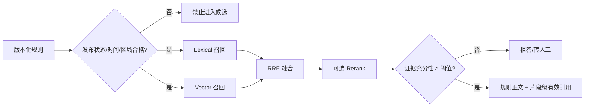
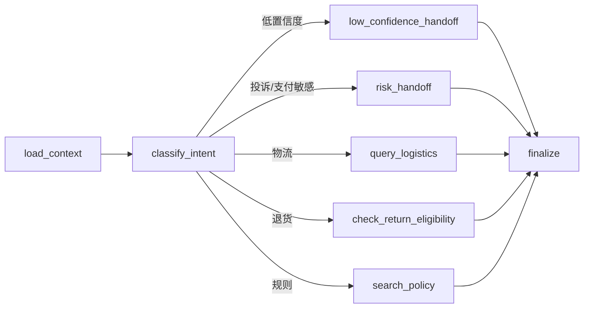
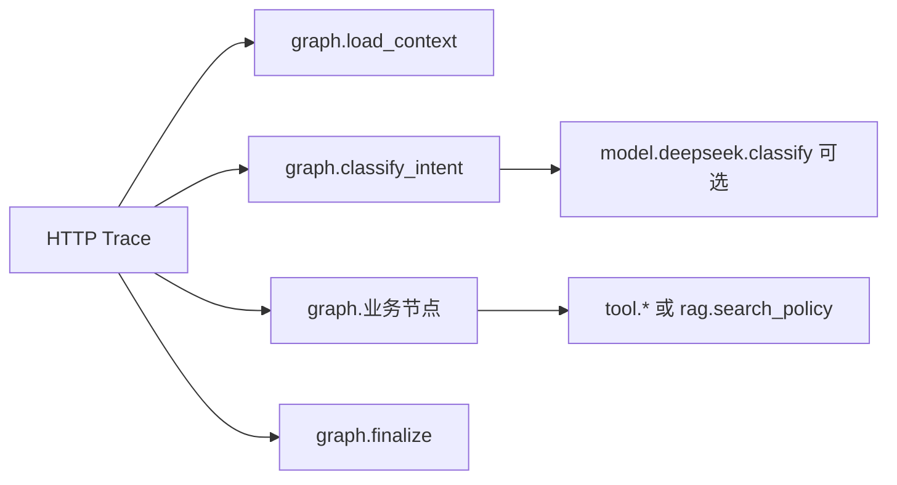

# 解决方案设计

`/assist` 是 MVP 编排入口，由 LangGraph 显式状态图执行 `load_context → classify_intent → 条件业务节点 → finalize`。条件业务节点包括低置信度转人工、高风险转人工、物流查询、退换货判断和规则检索；节点通过依赖注入调用现有 Service，不直接访问或修改业务数据。意图分类优先使用显式安全信号和配置的 DeepSeek，失败时回退到确定性安全路由。订单 Tool 只读取匿名模拟数据并校验归属。规则 Tool 先将 `published + 生效时间窗口 + 区域` 作为硬准入条件，再执行 lexical/vector 候选生成与 RRF 融合，最后通过独立证据充分性门禁；只有直接支持问题的片段才能成为答案和引用。重排是可选策略而非固定装饰，本地消融未证明测试 reranker 的边际收益，因此默认 `fusion`；生产真实 reranker 必须在相同评测契约下证明收益后启用。

## RAG 正确性边界

版本生命周期、检索相关性和证据充分性是三种不同判断。旧版本即使措辞更贴近问题也不得进入候选；主题相关的规则即使排在 Top1，如果不能回答“发票、赔付、保险”等细节也必须拒答。POC 的证据门禁使用知识负责人维护的可回答范围和确定性匹配，生产可替换为经校准的 NLI/模型验证器，但不得删除这一契约。

LangGraph 状态只承载本轮请求所需的输入、路由判断、Tool 结果和待持久化更新。跨请求会话仍以 SQLite `ConversationStore` 为事实来源，工单和退货申请仍由各自 Service 持久化；当前不启用 LangGraph checkpointer，避免与既有业务存储形成双写。若未来引入需要暂停并在同一次图执行中恢复的长事务，再为该工作流设计单一持久化所有权和生产级 checkpointer。

核心产品取舍是：模型理解用户，业务 Tool 证明事实，人工处理例外。模型不生成订单事实、退货结论或规则引用；没有可靠依据时拒答或转人工。这样牺牲部分自动化覆盖率，换取事实可追溯、风险可控和失败可解释。

退货采用两阶段状态流转：`check_return_eligibility` 只读判断资格；只有消费者明确点击确认后，前端才调用 `submit_return_application`。后者返回申请单号和“待审核”状态，不代表退款完成，并使用幂等键防止重复申请。

交互层采用“消息即上下文”原则：需要用户确认的业务动作以操作卡片嵌入对应的 AI 消息中，用户确认和处理结果继续追加到会话流；输入区仅保留消息输入及身份/订单提示。其他业务动作（投诉建单、人工接管等）沿用同一规则，避免操作与触发它的业务结果脱节。

退货申请提交后进入独立的人工审核队列；“人工接管”页面同时展示投诉工单和退货审核记录，但二者使用不同的业务类型和状态，不将“待审核”误认为普通投诉工单。

审核状态只能由人工客服或主管推进：`待审核 → 审核通过` 或 `待审核 → 审核不通过`。驳回必须记录原因，审核完成后不允许重复操作；审核队列只展示仍待处理的申请。

消费者端不保存业务状态快照作为事实来源。提交后记录申请单号，并通过申请查询接口定时刷新；审核结果更新会同步覆盖会话中的状态和处理链路。

人工接管工单支持最小处理闭环：队列展示摘要和状态，客服提交回复与处理结果后更新工单；工单状态变化由服务端校验，避免前端只改显示而没有真实业务状态。

客服工作台采用页面内会话详情交互：客服点击工单后展开消息流、用户/订单上下文、回复输入框和处理状态选择器；浏览器弹窗不作为正式客服回复入口。

工作台采用角色到视图的显式白名单映射：消费者 `guide/chat`；人工客服 `chat/tickets`；客服主管 `tickets/metrics/rules`；实施管理员 `guide/metrics/rules`。普通用户角色选择器只展示消费者、人工客服和客服主管；实施管理员保留内部权限标识 `implementer`，通过内部入口或受控身份进入。导航、页面访问和右侧快捷操作均使用同一白名单，角色切换后落到该角色的第一个允许页面。

规则问答展示 Tool 返回的 `data.answer` 作为主回答，并附带引用标题与版本；过程状态文案不能替代规则正文。

所有 Tool 返回统一的 `success/data/error_code/message/trace_id`。无订单、无规则、订单异常和高风险争议均不能生成确定性事实。会话、工单、退货申请和质量事件在 POC 中使用 SQLite。当前前端提供基础指标和风险事件视图，不是生产级实时质量看板。生产环境需将模拟身份、SQLite 和本地 JSON 替换为客户认证、生产数据库、可靠事件流和可评测的混合检索。

## 运行可观测性

运行诊断与业务质量事件分开存储：`EventStore` 保留会话/Tool 的业务统计事件，`TraceStore` 只负责请求执行链路。HTTP 中间件为每个请求创建新的 `trace_id`，写入响应体（统一 Tool 响应）和 `X-Trace-Id` 响应头；`/assist` 内部将每个 LangGraph 节点记录为 `graph.*` Span，并将模型、RAG、Tool 记录为其子 Span。这样既能看到“经过了哪些节点”，也能定位“哪次外部/业务调用失败或变慢”。

Span 只记录低基数技术属性，例如节点名、Tool 名、意图、候选数、引用数、Provider、状态和错误码；不记录原始问题、订单详情、令牌、地址或联系方式。完整 Trace/Span 默认保存在 `runtime/observability.db`，同时输出单行 JSON 运行日志。管理接口支持按 `trace_id` 回放，以及按窗口聚合请求/操作的失败率和 P50/P95；当前不包含外部采集器、分布式传播、告警推送、采样和自动数据保留，生产化时应迁移到 OpenTelemetry Collector 与后端存储，并保留当前操作命名和属性契约。
